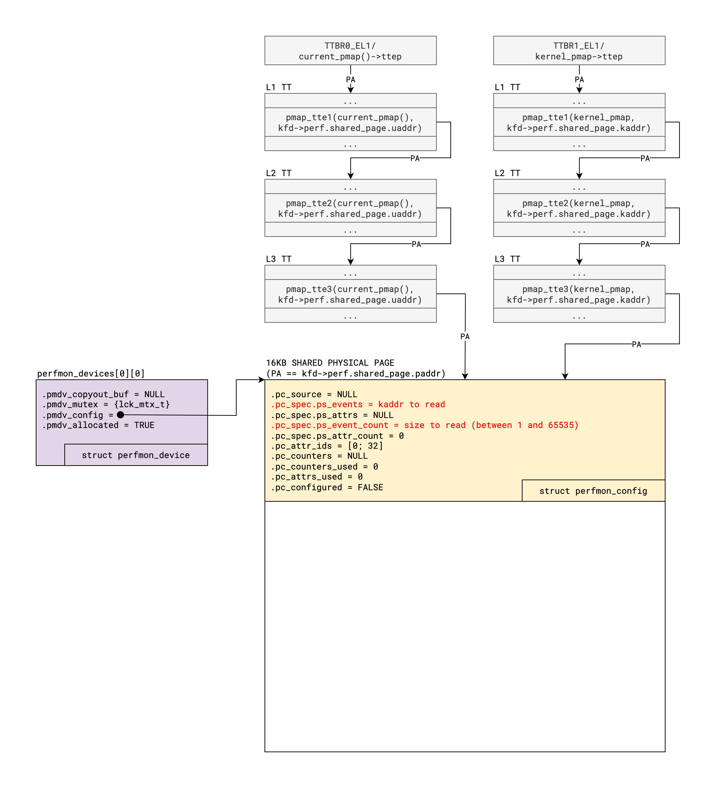
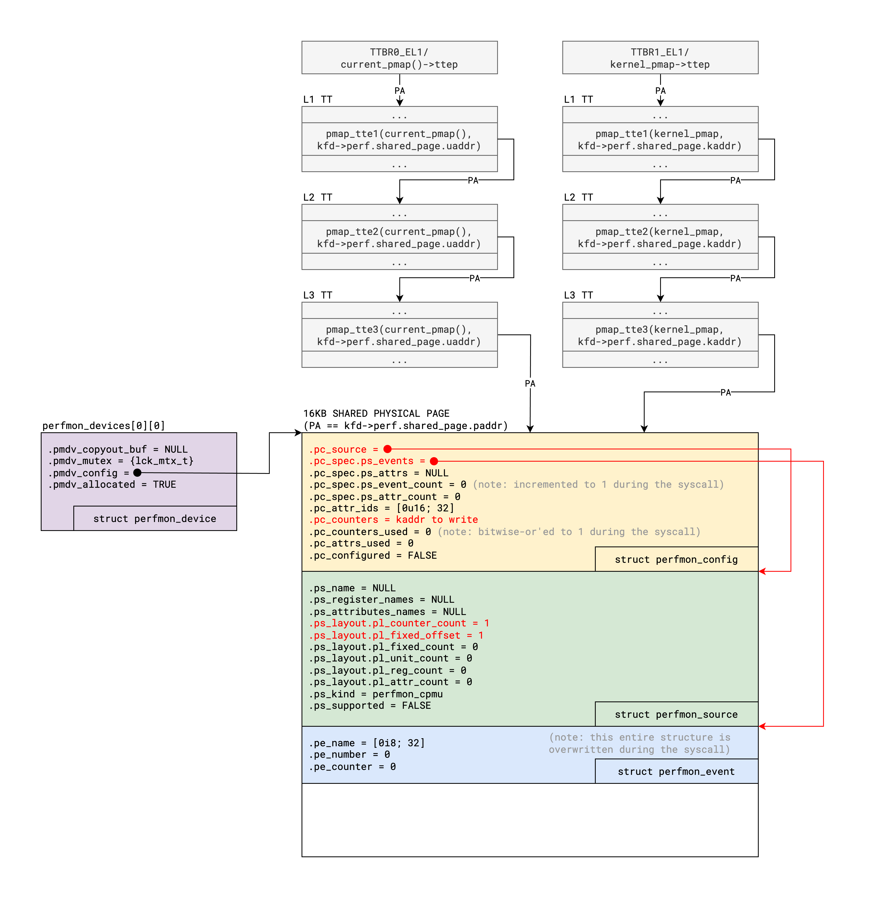

# Exploiting PUAFs

---

## Table of Contents

- [What is a PUAF primitive?](#what-is-a-puaf-primitive)
- [What to do before a PUAF exploit?](#what-to-do-before-a-puaf-exploit)
- [What to do after a PUAF exploit?](#what-to-do-after-a-puaf-exploit)
- [Impact of XNU mitigations on PUAF exploits](#impact-of-xnu-mitigations-on-puaf-exploits)
- [Appendix: Discovery of the PUAF primitive](#appendix-discovery-of-the-puaf-primitive)

---

## What is a PUAF primitive?

PUAF is an acronym for "physical use-after-free". As opposed to a normal UAF, which stems from a
dangling pointer to a virtual address (VA), a PUAF originates from a dangling pointer to the
physical address (PA) of a memory region. Although PA pointers could be stored in other kernel data
structures, here it will be assumed that the dangling PA pointer is contained directly in a
leaf-level page table entry (i.e. an L3 PTE in the case of iOS and macOS) from the page table
hierarchy of the exploiting user process. In addition, in order to qualify as a PUAF primitive, it
will also be assumed that the corresponding physical page has been put back on the free list. In
XNU, every physical page of memory is represented by a `vm_page` structure, whose `vmp_q_state`
field determines which queue the page is on, and whose `vmp_pageq` field contains 32-bit packed
pointers to the next and previous pages in that queue. Note that the main "free list" in XNU is
represented by `vm_page_queue_free`, which is an array of `MAX_COLORS` (128) queues (although the
actual number of free queues used depends on the device configuration). Finally, although a dangling
PTE with read-only access in the AP bits (e.g. [P0 issue 2337][1]) would still be considered an
important security vulnerability, it would not be directly exploitable. Therefore, in this write-up,
a PUAF primitive entails that the dangling PTE gives read/write access to user space in the AP bits.
To summarize, in order to obtain a PUAF primitive, we must achieve a dangling L3 PTE with read/write
access on a physical page which has been put back on the free list, such that the kernel can grab it
and reuse it for absolutely anything!

[1]: https://bugs.chromium.org/p/project-zero/issues/detail?id=2337

---

## What to do before a PUAF exploit?

As mentioned above, once a PUAF primitive has been achieved, the corresponding physical pages could
be reused for anything. However, if the higher-privileged Page Protection Layer (PPL) is running out
of free pages in `pmap_ppl_free_page_list`, the regular kernel might grab pages from its own free
queues and give them to PPL by calling `pmap_mark_page_as_ppl_page_internal()`. That said, this PPL
routine will verify that the given page is indeed not mapped outside of the physical aperture, or
else it  will trigger a "page still has mappings" panic. But since a PUAF primitive requires a
dangling PTE, this check would always fail and cause a kernel panic. Therefore, after obtaining PUAF
pages, we must avoid marking them as PPL-owned. Hence, before starting a PUAF exploit, we should
attempt to fill `pmap_ppl_free_page_list` as much as possible, such that PPL is less likely to run
out of free pages during the critical section of the exploit. Fortunately, we can easily allocate
PPL-owned pages by calling `vm_allocate()` with the flag `VM_FLAGS_FIXED` for all addresses aligned
to the L2 block size inside the allowed VA range of our VM map. If there were previously no mappings
in that L2 block size, then PPL will first need to allocate an L3 translation table to accommodate
the new mapping. Then, we can simply deallocate those mappings and PPL will put the empty L3
translation table pages back in `pmap_ppl_free_page_list`. This is done in the function
`puaf_helper_give_ppl_pages()`, located in [puaf.h](../kfd/libkfd/puaf.h).

On macOS, the maximum VA that is mappable by a user process (i.e. `current_map()->max_offset`) is
quite high, such that we can fill the PPL page free list with an extremely large number of pages.
However, on iOS, the maximum VA is much lower, such that we can only fill it with roughly 200 pages.
Despite that, I almost never run into the "page still has mappings" panic, even when the exploit is
configured to obtain 2048 PUAF pages, which works great for personal research. Please note that a
higher number of PUAF pages makes it easier for the rest of the exploit to achieve a kernel
read/write primitive. That said, for maximum reliability, if the PUAF exploit is repeatable (e.g.
PhysPuppet and Landa), an attacker could instead obtain a PUAF primitive on a smaller number of
pages, then attempt to get the kernel read/write primitive, and repeat the process as needed if the
latter part did not succeed.

---

## What to do after a PUAF exploit?

Let's suppose that we have successfully exploited a vulnerability to obtain a PUAF primitive on an
arbitrary number of physical pages, now what? Note that free pages are added at the tail of the free
queues by the `vm_page_queue_enter()` macro, but there is no way from user space to know exactly
where our PUAF pages are going to be located in those free queues. In order to remedy that, we can
do the following:

1. Run some code that will grab a few pages from the free queues and populate them with unique and
   recognizable content.
2. Scan all the PUAF pages for that recognizable content by reading through the dangling PTEs.
3. If we find the content, then we have reached the PUAF pages in one of the free queues, so we can
   move on to the next stage. Otherwise, we go back to step 1 to grab a few more pages, and we
   repeat this loop until we finally hit the PUAF pages.

This stage of the exploit could probably be optimized tremendously to take into account the fact
that `vm_page_queue_free` is made up of an array of free queues. However, as it stands, the exploit
will simply grab free pages in chunks of 4 by calling `vm_copy()` on a purgeable source region,
until a quarter of the PUAF pages have been successfully grabbed. This is a gross heuristic that
completely wastes 25% of the PUAF pages, but it has worked exceedingly well for me, so I never had
to optimize it further. This is done in the function `krkw_helper_grab_free_pages()`, located in
[krkw.h](../kfd/libkfd/krkw.h), which I might upgrade in the future.

Now that our PUAF pages are likely to be grabbed, we can turn the PUAF primitive into a more
powerful kernel read/write primitive with the following high-level strategy:

1. Spray an "interesting" kernel object, such that it is reallocated in one of the remaining PUAF
   pages.
2. Scan the PUAF pages through the dangling PTEs for a "magic value" to confirm the successful
   reallocation and to identify exactly which PUAF page contains the target kernel object.
3. Overwrite a non-PAC'ed kernel pointer in the target kernel object with a fully controlled value,
   by directly overwriting it through the appropriate dangling PTE. It would also be possible to
   craft a set of fake kernel objects within the PUAF pages if necessary, but none of the methods
   described below require that.
4. Get a kernel read or kernel write primitive through a syscall that makes use of the overwritten
   kernel pointer.

For example, in my original exploit for PhysPuppet, I was inspired by SockPuppet and decided to
target socket-related objects. Thus, the generic steps listed above would map to the specific
actions listed below:

1. Spray `inp_tp` structures with the `socket()` syscall.
2. Scan the PUAF pages for the magic value in the `t_keepintvl` field, which has been set with the
   `setsockopt()` syscall for the `TCP_KEEPINTVL` option.
3. Overwrite the `inp6_outputopts` field, which is a pointer to a `ip6_pktopts` structure.
4. Get a 4-byte kernel read primitive from `inp6_outputopts->ip6po_minmtu` with the `getsockopt()`
   syscall for the `IPV6_USE_MIN_MTU` option, and get a 4-byte kernel write primitive restricted to
   values between -1 and 255 from `inp6_outputopts->ip6po_tclass` with the `setsockopt()` syscall
   using the `IPV6_TCLASS` option.

However, I was not really satisfied with this part of the exploit because the kernel write
primitive was too restricted and the required syscalls (i.e. `socket()` and `[get/set]sockopt()`)
are all denied from the WebContent sandbox. That said, when I found the vulnerability for Smith,
which was exploitable from WebContent unlike PhysPuppet, I decided to look for other interesting
target kernel objects which could be sprayed from the WebContent sandbox, such that the entire
exploit satisfied that constraint. Unlike for the socket method described above, which used the same
target kernel object for both the kernel read and write primitives, I ended up finding distinct
objects for both primitives.

Here is the description of the
[`kread_kqueue_workloop_ctl` method](../kfd/libkfd/krkw/kread/kread_kqueue_workloop_ctl.h):

1. Spray `kqworkloop` structures with the `kqueue_workloop_ctl()` syscall.
2. Scan the PUAF pages for the magic value in the `kqwl_dynamicid` field, which has been set
   directly by `kqueue_workloop_ctl()` above.
3. Overwrite the `kqwl_owner` field, which is a pointer to a `thread` structure.
4. Get an 8-byte kernel read primitive from `kqwl_owner->thread_id` with the `proc_info()` syscall
   for the `PROC_INFO_CALL_PIDDYNKQUEUEINFO` callnum.

And here is the description of the [`kwrite_dup` method](../kfd/libkfd/krkw/kwrite/kwrite_dup.h):

1. Spray `fileproc` structures with the `dup()` syscall (to duplicate any file descriptor).
2. This time, no fields can be set to a truly unique magic value for the `fileproc` structure.
   Therefore, we scan the PUAF pages for the expected bit pattern of the entire structure. Then, we
   use the `fcntl()` syscall with the `F_SETFD` cmd to update the value of the `fp_flags` field to
   confirm the successful reallocation and to identify exactly which file descriptor owns that
   `fileproc` object.
3. Overwrite the `fp_guard` field, which is a pointer to a `fileproc_guard` structure.
4. Get an 8-byte kernel write primitive from `fp_guard->fpg_guard` with the `change_fdguard_np()`
   syscall. However, that method cannot overwrite a value of 0, nor overwrite any value to 0.

This worked well enough, and at the time of writing, all the syscalls used by those methods are part
of the WebContent sandbox. However, although the `proc_info()` syscall is allowed, the
`PROC_INFO_CALL_PIDDYNKQUEUEINFO` callnum is denied. Therefore, I had to find another kernel read
primitive. Fortunately, it was pretty easy to find one by looking at the other callnums of
`proc_info()` which are allowed by the WebContent sandbox.

Here is the description of the [`kread_sem_open` method](../kfd/libkfd/krkw/kread/kread_sem_open.h):

1. Spray `psemnode` structures with the `sem_open()` syscall.
2. Once again, no fields can be set to a truly unique magic value for the `psemnode` structures.
   Therefore, we scan the PUAF pages for four consecutive structures, which should contain the same
   `pinfo` pointer in the first 8 bytes and zero padding in the second 8 bytes. Then, we increment
   the `pinfo` pointer by 4 through the dangling PTE and we use the `proc_info()` syscall to
   retrieve the name of the posix semaphore, which should now be shifted by 4 characters when we hit
   the right file descriptor.
3. Overwrite the `pinfo` field, which is a pointer to a `pseminfo` structure.
4. Get an 8-byte kernel read primitive from `pinfo->psem_uid` and `pinfo->psem_gid` with the
   `proc_info()` syscall for the `PROC_INFO_CALL_PIDFDINFO` callnum, which is not denied by the
   WebContent sandbox.

Please note that `shm_open()`, which is also part of the WebContent sandbox, could also be used to
achieve a kernel read primitive, in much the same way as `sem_open()`. However, `sem_open()` makes
it easier to determine the address of `current_proc()` through the semaphore's `owner` field.
Lastly, the [`kwrite_sem_open` method](../kfd/libkfd/krkw/kwrite/kwrite_sem_open.h) works just like
the `kwrite_dup` method, but the `fileproc` structures are sprayed with the `sem_open()` syscall
instead of the `dup()` syscall.

At this point, we have a decent kernel read/write primitive, but there are some minor encumbrances:

- The kernel read primitive successfully reads 8 bytes from `pinfo->psem_uid` and `pinfo->psem_gid`,
  but it also reads other fields of the `pseminfo` structure located before and after those two.
  This can cause problems if the address we want to read is located at the very beginning of a page.
  In that case, the fields before `psem_uid` and `psem_gid` would end up in the previous virtual
  page, which might be unmapped and therefore cause a "Kernel data abort" panic. Of course, in such
  a case, we could use a variant that is guaranteed to not underflow a page by using the first bytes
  read from the modified kernel pointer. This is done in the function `kread_sem_open_kread_u32()`.
- The kernel write primitive cannot overwrite a value of 0, nor overwrite any value to 0. There are
  simple workarounds for both scenarios. For example, the function `smith_helper_cleanup()` uses
  such a workaround to overwrite a value of 0. The workaround to overwrite a value to 0 is left as
  an exercise for the reader.

Although we can overcome these impediments easily, it would be nice to bootstrap a better kernel
read/write from those initial primitives. This is achieved in [perf.h](../kfd/libkfd/perf.h),
but libkfd only supports this part of the exploit on the iPhone 14 Pro Max for certain versions
of iOS (see the supported versions in the function `perf_init()`). Currently, I am using some static
addresses from those kernelcaches to locate certain global kernel objects (e.g. `perfmon_devices`),
which cannot be found easily by chasing data pointers. It would probably be possible to achieve the
same outcome dynamically by chasing offsets in code, but this is left as an exercise for the reader
for now. As it stands, here is how the setup for the better kernel read/write is achieved:

1. We call `vm_allocate()` to allocate a single page, which will be used as a shared buffer between
   user space and kernel space later on. Note that we also call `memset()` to fault in that virtual
   page, which will grab a physical page and populate the corresponding PTE.
2. We call `open("/dev/aes_0", O_RDWR)` to open a file descriptor. Please note that we could open
   any character device which is accessible from the target sandbox, because we will corrupt it
   later on to redirect it to `"/dev/perfmon_core"` instead.
3. We use the kernel read primitive to obtain the slid address of the function `vn_kqfilter()` by
   chasing the pointers `current_proc()->p_fd.fd_ofiles[fd]->fp_glob->fg_ops->fo_kqfilter`, where
   "fd" is the opaque file descriptor returned by the `open()` syscall in the previous step.
4. We calculate the kernel slide by substracting the slid address of the function `vn_kqfilter()`
   with the static address of that function in the kernelcache. We then make sure that the base of
   the kernelcache contains the expected Mach-O header.
5. We use the kernel read primitive to scan the `cdevsw` array until we find the major index for
   `perfmon_cdevsw`, which seems to always be 0x11.
6. From the `fileglob` structure we found earlier, we use the kernel read primitive to retrieve the
   original `dev_t` from `fg->fg_data->v_specinfo->si_rdev` and we use the kernel write primitive to
   overwrite it such that it indexes into `perfmon_cdevsw` instead. In addition, the `si_opencount`
   field is incremented by one to prevent `perfmon_dev_close()` from being called if the process
   exits before calling `kclose()`, which would trigger a "perfmon: unpaired release" panic.
7. We use the kernel read primitive to retrieve a bunch of useful globals (`vm_pages`,
   `vm_page_array_beginning_addr`, `vm_page_array_ending_addr`, `vm_first_phys_ppnum`, `ptov_table`,
   `gVirtBase`, `gPhysBase` and `gPhysSize`) as well as TTBR0  from `current_pmap()->ttep` and TTBR1
   from `kernel_pmap->ttep`.
8. We can then manually walk our page tables starting from TTBR0 to find the physical address of the
   shared page allocated in step 1. And since we retrieved the `ptov_table` in the previous step, we
   can then use `phystokv()` to find the kernel VA for that physical page inside the physmap.
9. Finally, we use the kernel write primitive to corrupt the `pmdv_config` field of the first
   perfmon device to point to the shared page (i.e. with the kernel VA retrieved in the previous
   step), and to set the `pmdv_allocated` boolean field to `true`.

At this point, the setup is complete. To read kernel memory, we can now craft a `perfmon_config`
structure in the shared page, as shown in the image below, then use the `PERFMON_CTL_SPECIFY` ioctl
to read between 1 and 65535 bytes from an arbitrary kernel address. In addition, note that the
region being read must satisfy the `zone_element_bounds_check()` in `copy_validate()`, because this
technique uses `copyout()` under the hood.

To write kernel memory, we can now craft a `perfmon_config`, `perfmon_source` and  `perfmon_event`
structure in the shared page, as shown in the image below, then use the `PERFMON_CTL_ADD_EVENT`
ioctl to write 8 bytes to an arbitrary kernel address. That said, at that point, `kwrite()` can
accept any size that is a multiple of 8 because it will perform this technique in a loop.

Finally, on `kclose()`, the function `perf_free()` will restore the `si_rdev` and `si_opencount`
fields to their original values, such that all relevant kernel objects are cleaned up properly when
the file descriptor is closed. However, if the process exits before calling `kclose()`, this cleanup
will be incomplete and the next attempt to `open("/dev/aes_0", O_RDWR)` will fail with `EMFILE`.
Therefore, it would be cleaner to use the kernel write primitive to "manually" close the
device-specific kernel objects of that file descriptor, such that the process could exit at any
moment and still leave the kernel in a clean state. For now, this is left as an exercise for the
reader.

---

## Impact of XNU mitigations on PUAF exploits

So, how effective were the various iOS kernel exploit mitigations at blocking the PUAF technique?
The mitigations I condisered were KASLR, PAN, PAC, PPL, `zone_require()`, and `kalloc_type()`:

- KASLR does not really impact this technique since we do not need to leak a kernel address in order
  to obtain the PUAF primitive in the first place. Of course, we eventually want to obtain the
  addresses of the kernel objects that we want to read or write, but at that point, we have endless
  possibilities of objects to spray inside the PUAF pages in order to gather that information.
- PAN also does not really have an impact on this technique. Although none of the kread and kwrite
  methods I described above required us to craft a set of fake kernel objects, other methods could.
  In that case, the absence of PAN would be useful. However, in practice, there are plenty of
  objects that could leak the address of the PUAF pages in kernel space, such that we could craft
  those fake objects directly in those PUAF pages.
- PAC as a form of control flow integrity is completely irrelevant for this technique as it is a
  form of data-only attack. That said, in my opinion, PAC for data pointers is the mitigation that
  currently has the biggest impact on this technique, because there are a lot more kernel objects
  that we could target in order to obtain a kernel read/write primitive if certain members of those
  structures had not been signed.
- PPL surprisingly does very little to prevent this technique. Of course, it prevents the PUAF pages
  from being reused as page tables and other PPL-protected structures. But in practice, it is very
  easy to dodge the "page still has mappings" panic and to reuse the PUAF pages for other
  interesting kernel objects. I expect this to change!
- `zone_require()` has a similar impact as data-PAC for this technique, by preventing us from
  forging kernel pointers inside the PUAF pages if they are verified with this function.
- `kalloc_type()` is completely irrelevant for this technique as it only provides protection against
  virtual address reuse, as opposed to physical address reuse.

---

## Appendix: Discovery of the PUAF primitive

First of all, I want to be clear that I do not claim to be the first researcher to discover this
primitive. As far as I know, Jann Horn of Google Project Zero was the first researcher to publicly
report and disclose dangling PTE vulnerabilities:

- [P0 issue 2325][2], reported on June 29, 2022 and disclosed on August 24, 2022.
- [P0 issue 2327][3], reported on June 30, 2022 and disclosed on September 19, 2022.

In addition, TLB flushing bugs could be considered a variant of the PUAF primitive, which Jann Horn
found even earlier:

- [P0 issue 1633][4], reported on August 15, 2018 and disclosed on September 10, 2018.
- [P0 issue 1695][5], reported on October 12, 2018 and disclosed on October 29, 2018.

For iOS, I believe Ian Beer was the first researcher to publicly disclose a dangling PTE
vulnerability, although with read-only access:

- [P0 issue 2337][6], reported on July 29, 2022 and disclosed on November 25, 2022.

Please note that other researchers might have found similar vulnerabilities earlier, but these are
the earliest ones I could find. I reported PhysPuppet to Apple a bit before Ian Beer's issue was
disclosed to the public and, at that time, I was not aware of Jann Horn's research. Therefore, in
case it is of interest to other researchers, I will share how I stumbled upon this powerful
primitive. When I got started doing vulnerability research, during the first half of 2022, I found
multiple buffer overflows in the SMBClient kernel extension and a UAF in the in-kernel NFS client
(i.e. a normal UAF that reuses a VA and not a PA). However, given that I was pretty unexperienced
with exploitation back then and that Apple had already delivered a lot of mitigations for classical
memory corruption vulnerabilities, I had no idea how to exploit them. My proofs-of-concept would
only trigger "one-click" remote kernel panics, but that quickly became unsatisfying. Therefore,
during the second half of 2022, I decided to look for better logic bugs in the XNU kernel. In
particular, I was inspired to attack physical memory by Brandon Azad's blog post
[One Byte to rule them all][7]. That said, his technique required a one-byte linear heap overflow
primitive (amongst other things) to gain the arbitrary physical mapping primitive. But I was
determined to avoid memory corruption, so I decided to look for other logic bugs that could allow a
user process to control the physical address entered in one of its own PTEs. After spending a lot of
time reading and re-reading the VM map and pmap code, I eventually came to the conclusion that
obtaining an arbitrary physical mapping primitive as an initial primitive would be unrealistic.
Fortunately, I got incredibly lucky right after that!

As I was perusing the code in `vm_map.c` for the thousandth time, I was struck by just how many
functions would assert that the start and end addresses of a `vm_map_entry` structure are
page-aligned (e.g. in `vm_map_enter()`, `vm_map_entry_insert()`, `vm_map_entry_zap()`, and many
other functions). Given that those assertions are not enabled in release builds, I was curious to
know what would happen if we could magically create an "unaligned entry" in our VM map? For example,
if the `vme_start` field was equal to a page-aligned address A but the `vme_end` field was equal to
A + PAGE_SIZE + 1, how would the functions `vm_fault()` and `vm_map_delete()` behave? To my
astonishment, I realized that this condition would trivially lead to a dangling PTE. That said, at
that point in time, this was just an idea, albeit a very promising one! Therefore, I went on to look
for logic bugs that could allow an attacker to create such an unaligned entry. First, I investigated
all the attack surface that was reachable from the WebContent sandbox but I was not able to find one.
However, after giving up on a vulnerability reachable from WebContent, I quickly came across the MIG
routine `mach_memory_object_memory_entry_64()` and found the vulnerability for PhysPuppet, which is
covered in detail in a separate [write-up](physpuppet.md).

After that, I checked online for existing exploits that achieved a PUAF primitive. At that time, I
could not find any for iOS but that is when I stumbled upon Jann Horn's Mali issues. As a quick
aside, I also skimmed his blog post about [exploiting a simple Linux memory corruption bug][8],
which I mistakenly thought was a variant of the PUAF primitive with a dangling PTE in kernel space
rather than user space. I later realized that this was just a normal UAF, but I got confused because
he exploited it through the page allocator by reallocating the victim page as a page table. That
said, I knew this would not be possible on iOS because of the formidable PPL. However, as I was
already familiar with Ned Williamson's [SockPuppet exploit][9], I had a pretty solid hunch that I
could exploit the dangling PTEs by reallocating socket-related objects inside the PUAF pages, then
by using the `getsockopt()`/`setsockopt()` syscalls in order to obtain the kernel read/write
primitives, respectively.

[2]: https://bugs.chromium.org/p/project-zero/issues/detail?id=2325
[3]: https://bugs.chromium.org/p/project-zero/issues/detail?id=2327
[4]: https://bugs.chromium.org/p/project-zero/issues/detail?id=1633
[5]: https://bugs.chromium.org/p/project-zero/issues/detail?id=1695
[6]: https://bugs.chromium.org/p/project-zero/issues/detail?id=2337
[7]: https://googleprojectzero.blogspot.com/2020/07/one-byte-to-rule-them-all.html
[8]: https://googleprojectzero.blogspot.com/2021/10/how-simple-linux-kernel-memory.html
[9]: https://googleprojectzero.blogspot.com/2019/12/sockpuppet-walkthrough-of-kernel.html
