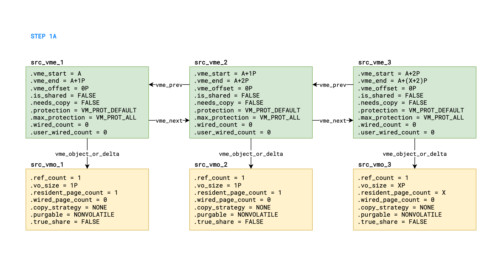
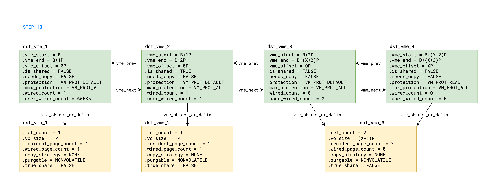
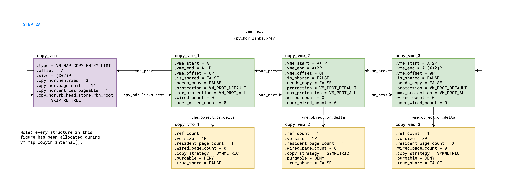
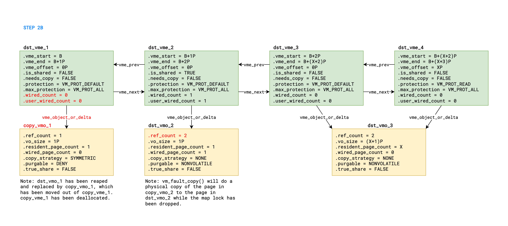
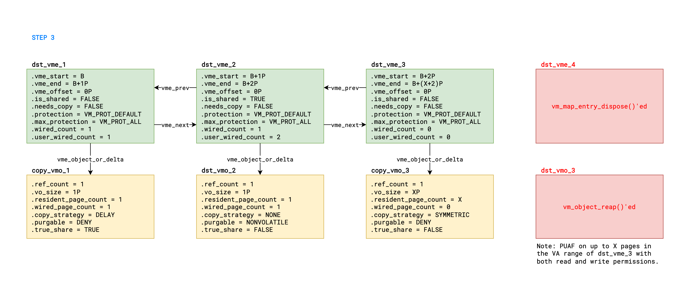

# Landa

In the original French:

> Il y avait une autre chose que je voulais vous demander.                                         \
> Mais maintenant, sur ma vie, impossible de m'en souvenir.                                        \
> Enfin, bon, ça ne devait pas être important.

Translated in English:

> I did have something else I wanted to ask you.                                                   \
> But right now, for the life of me, I can't remember what it is.                                  \
> Oh well, must not have been important.

Hans Landa - Inglourious Basterds

---

## Abbreviations

- KRKW: kernel read/write
- PUAF: physical use-after-free
- VMC: `vm_map_copy` structure
- VME: `vm_map_entry` structure
- VMO: `vm_object` structure

---

## Table of Contents

- [Introduction](#introduction)
- [Part A: From Vulnerability to PUAF](#part-a-from-vulnerability-to-puaf)
- [Part B: From PUAF to KRKW](#part-b-from-puaf-to-krkw)
- [Part C: From KRKW to Cleanup](#part-c-from-krkw-to-cleanup)

---

## Introduction

This write-up presents an exploit for a vulnerability in the XNU kernel:

- Assigned [CVE-2023-41974][1].
- Fixed in iOS 17.0 and macOS 14.0.
- Reachable from the App Sandbox but not the WebContent sandbox.
- Note that Landa is very similar to [P0 issue 2361][2], which was a race condition that allowed
  writing to read-only mappings. Specifically, `vm_map_copy_overwrite_nested()` would check that the
  VMEs in the destination range are overwriteable, but `vm_map_copy_overwrite_unaligned()` could
  drop the map lock and it would not perform the same check after taking it back. Landa works the
  same way, but for VMEs that are "in transition" instead.

The exploit has been successfully tested on:

- iOS 16.5 and 16.5.1 (iPhone 14 Pro Max)
- macOS 13.4 and 13.4.1 (MacBook Air M2 2022)

All code snippets shown below are from [xnu-8796.101.5][3].

[1]: https://support.apple.com/en-us/HT213938
[2]: https://bugs.chromium.org/p/project-zero/issues/detail?id=2361
[3]: https://github.com/apple-oss-distributions/xnu/tree/xnu-8796.101.5

---

## Part A: From Vulnerability to PUAF

This part of the exploit is made up of 3 steps, which are labeled in the function `landa_run()`,
located in [landa.h](../kfd/libkfd/puaf/landa.h). Each step will be described in detail below, with
figures illustrating the relevant kernel state at certain points in the exploit. Note that the green
boxes represent VMEs, the yellow boxes represent VMOs, the purple boxes represent VMCs, and the red
text highlights the difference compared to the previous figure. Also, please note that X denotes the
desired number of PUAF pages and P denotes the page size (i.e. 16384 bytes). Lastly, before reading
the description of each step, please check the corresponding code in the function `landa_run()`, as
it won't be repeated here.

#### STEP 1:

This step is responsible for the setup, such that we can trivially win the race condition in step 2.
In substep 1A, we `vm_allocate()` a memory region of (X+2) pages at a random address A, which will
be used as the source range of the copy in step 2. Then, we split that memory region into three
distinct VMEs, described in the list below in ascending address order:

- `src_vme_1` has a size of 1 page and owns the only reference to `src_vmo_1`.
- `src_vme_2` has a size of 1 page and owns the only reference to `src_vmo_2`.
- `src_vme_3` has a size of X pages and owns the only reference to `src_vmo_3`.

Note that all source VMEs are initialized with a purgeable object, which has a `copy_strategy` of
`MEMORY_OBJECT_COPY_NONE`, by using the flag `VM_FLAGS_PURGABLE`. In addition, the entire source
range is faulted in with `memset()`. Here is an illustration of the relevant kernel state after
substep 1A:



In substep 1B, we `vm_allocate()` a memory region of (X+3) pages at a random address B, which will
be used as the destination range of the copy in step 2, except for the last page. Then, we split
that memory region into four distinct VMEs, described in the list below in ascending address order:

- `dst_vme_1` has a size of 1 page and owns the only reference to `dst_vmo_1`. Also,
  `dst_vme_1->user_wired_count` is set to `MAX_WIRE_COUNT` with a simple `mlock()` for-loop.
- `dst_vme_2` has a size of 1 page and owns the only reference to `dst_vmo_2`. Also,
  `dst_vme_2->is_shared` is set to `TRUE` by remapping it on itself with `vm_remap()` and
  `dst_vme_2->user_wired_count` is set to 1 with a single call to `mlock()`.

A single VME is originally allocated in the last (X+1) pages, but it is then clipped into two VMEs
by marking the last page as read-only with `vm_protect()`:

- `dst_vme_3` has a size of X pages and owns one of two references on `dst_vmo_3`.
- `dst_vme_4` has a size of 1 page and owns the other reference on `dst_vmo_3`. Also,
  `dst_vme_4->protection` is set to `VM_PROT_READ` by `vm_protect()`.

Once again, note that all destination VMEs are initialized with a purgeable object, which has a
`copy_strategy` of `MEMORY_OBJECT_COPY_NONE`, by using the flag `VM_FLAGS_PURGABLE`. In addition,
the entire destination range, which excludes the read-only page of `dst_vme_4`, is faulted in with
`memset()`. Here is an illustration of the relevant kernel state after substep 1B:



#### STEP 2:

Before triggering the race condition in earnest, we first spawn another thread to run the function
`landa_helper_spinner_pthread()`, which will attempt to wire (X+2) pages starting at address B (i.e.
`dst_vme_1` to `dst_vme_3`) in a busy-loop. However, `dst_vme_1->user_wired_count` is already set to
`MAX_WIRE_COUNT`, so `mlock()` does basically nothing and just returns `ENOMEM`. Next, from the main
thread, we call `vm_copy()` to copy (X+2) pages from address A to address B, which will exploit the
race condition.

In substep 2A, we consider the `vm_map_copyin()` part of `vm_copy()`. Since the source range is
entirely made up of purgeable memory, no copy-on-write optimization is applied. Instead, three new
VMOs, `copy_vmo_1` to `copy_vmo_3`, are allocated to hold the (X+2) copied pages from the three
source VMOs, `src_vmo_1` to `src_vmo_3`, respectively. This happens over three distinct calls to
`vm_object_copy_strategically()` from `vm_map_copyin_internal()`. Finally, when `vm_map_copyin()`
returns, the output VMC contains three temporary VMEs, `copy_vme_1` to `copy_vme_3`, each of which
respectively owns the only reference to `copy_vmo_1` to `copy_vmo_3` at that point in time. Here is
an illustration of the relevant kernel state after substep 2A:



In substep 2B, we consider the `vm_map_copy_overwrite()` part of `vm_copy()`, up to the point where
`mlock()` is no longer stuck on `ENOMEM` in the spinner thread. First, the copy is completely
page-aligned, so `vm_map_copy_overwrite()` does not split the VMC with a "head" or "tail", and only
calls `vm_map_copy_overwrite_nested()` once. Just like for P0 issue 2361, that function checks that
all destination VMEs are overwriteable, which also includes making sure that the VMEs are not marked
as "in transition". At that point, `mlock()` is still stuck on `dst_vme_1->user_wired_count` being
equal to `MAX_WIRE_COUNT`, so the destination range (i.e. `dst_vme_1` to `dst_vme_3`) is guaranteed
not to be in transition. Therefore, `vm_map_copy_overwrite_nested()` proceeds and calls
`vm_map_copy_overwrite_aligned()` while holding the map lock. There will be three iterations of the
top-level while loop in `vm_map_copy_overwrite_aligned()`:

- In the 1st iteration, `copy_entry == copy_vme_1`, `entry == dst_vme_1`, and `object == dst_vmo_1`.
- In the 2nd iteration, `copy_entry == copy_vme_2`, `entry == dst_vme_2`, and `object == dst_vmo_2`.
- In the 3rd iteration, `copy_entry == copy_vme_3`, `entry == dst_vme_3`, and `object == dst_vmo_3`.

Also, please note that each pair of `copy_entry` and `entry` has been crafted to have the same size,
such that no clipping occurs. Finally, we get to the if-else statement which decides whether we take
the "fast path" or the "slow path", as shown in the snippet below:

```c
// Location: osfmk/vm/vm_map.c

static kern_return_t
vm_map_copy_overwrite_aligned(
    vm_map_t        dst_map,
    vm_map_entry_t  tmp_entry,
    vm_map_copy_t   copy,
    vm_map_offset_t start,
    __unused pmap_t pmap)
{
    vm_object_t     object;
    vm_map_entry_t  copy_entry;
    vm_map_size_t   copy_size;
    vm_map_size_t   size;
    vm_map_entry_t  entry;

    while ((copy_entry = vm_map_copy_first_entry(copy)) != vm_map_copy_to_entry(copy)) {
        ...

        // this if-else statement decides whether we take the fast path or the slow path
        if (((!entry->is_shared) &&
             ((object == VM_OBJECT_NULL) || (object->internal && !object->true_share))) ||
            (entry->needs_copy)) {
            // fast path branch
            ...
        } else {
            // slow path branch
            ...
        }
    }

    return KERN_SUCCESS;
}
```

During the first iteration, `dst_vme_1` and `dst_vmo_1` satisfy all the conditions to take the fast
path. The snippet below shows what happens inside the fast path branch during the first iteration:

```c
{
    // NOTE: this is inside the fast path branch
    vm_object_t         old_object = VME_OBJECT(entry); // old_object := dst_vmo_1
    vm_object_offset_t  old_offset = VME_OFFSET(entry); // old_offset := 0
    vm_object_offset_t  offset;

    if ((old_object == VME_OBJECT(copy_entry)) &&
        (old_offset == VME_OFFSET(copy_entry))) { // branch not taken because of different objects
        ...
    }

    ...

    if ((dst_map->pmap != kernel_pmap) &&
        (VME_ALIAS(entry) >= VM_MEMORY_MALLOC) &&
        (VME_ALIAS(entry) <= VM_MEMORY_MALLOC_MEDIUM)) { // branch not taken because alias is 0
        ...
    }

    if (old_object != VM_OBJECT_NULL) { // branch taken
        if (entry->is_sub_map) { // branch not taken because dst_vme_1->is_sub_map == FALSE
            ...
        } else {
            if (dst_map->mapped_in_other_pmaps) { // branch not taken
                ...
            } else {
                // PTEs in the VA range of dst_vme_1 are removed here
                pmap_remove_options(
                    dst_map->pmap,
                    (addr64_t)(entry->vme_start),
                    (addr64_t)(entry->vme_end),
                    PMAP_OPTIONS_REMOVE);
            }
            // dst_vmo_1 is deallocated and reaped here
            vm_object_deallocate(old_object);
        }
    }

    ...

    VME_OBJECT_SET(entry, VME_OBJECT(copy_entry), false, 0); // VME_OBJECT(dst_vme_1) := copy_vmo_1
    object = VME_OBJECT(entry);                              // object := copy_vmo_1
    entry->needs_copy = copy_entry->needs_copy;              // dst_vme_1->needs_copy := FALSE
    entry->wired_count = 0;                                  // dst_vme_1->wired_count := 0
    entry->user_wired_count = 0;                             // dst_vme_1->user_wired_count := 0
    offset = VME_OFFSET(copy_entry);                         // offset := 0
    VME_OFFSET_SET(entry, offset);                           // VME_OFFSET(dst_vme_1) := 0

    // copy_vme_1 is unlinked and deallocated here
    vm_map_copy_entry_unlink(copy, copy_entry);
    vm_map_copy_entry_dispose(copy_entry);

    start = tmp_entry->vme_end; // start := B+1P
    tmp_entry = tmp_entry->vme_next; // tmp_entry := dst_vme_2
}
```

In short, `dst_vmo_1` is deallocated and replaced with `copy_vmo_1`. The PTEs in the VA range of
`dst_vme_1` are also removed, although that is not relevant for the exploit. More importantly,
`dst_vme_1->wired_count` and `dst_vme_1->user_wired_count` are reset to 0. Note that we still hold
the map lock at this point, but as soon as we release it, `mlock()` will no longer be stuck in the
spinner thread.

Next, we go back to the top of the while loop for the second iteration. However, this time we take
the slow path because `dst_vme_2->is_shared` is set to `TRUE`. The snippet below shows what happens
inside the slow path branch during the second iteration:

```c
{
    // NOTE: this is inside the slow path branch
    vm_map_version_t    version;
    vm_object_t         dst_object;
    vm_object_offset_t  dst_offset;
    kern_return_t       r;

slow_copy:
    if (entry->needs_copy) { // branch not taken because dst_vme_2->needs_copy == FALSE
        ...
    }

    dst_object = VME_OBJECT(entry); // dst_object := dst_vmo_2
    dst_offset = VME_OFFSET(entry); // dst_offset := 0

    if (dst_object == VM_OBJECT_NULL) { // branch not taken
        ...
    }

    vm_object_reference(dst_object); // dst_vmo_2->ref_count++
    version.main_timestamp = dst_map->timestamp + 1;
    vm_map_unlock(dst_map); // map lock is dropped here

    copy_size = size; // copy_size := 1P

    r = vm_fault_copy(
        VME_OBJECT(copy_entry),
        VME_OFFSET(copy_entry),
        &copy_size,
        dst_object,
        dst_offset,
        dst_map,
        &version,
        THREAD_UNINT);

    vm_object_deallocate(dst_object); // dst_vmo_2->ref_count--

    if (r != KERN_SUCCESS) { // branch not taken because vm_fault_copy() returns KERN_SUCCESS
        ...
    }

    if (copy_size != 0) { // branch taken because copy_size == 1P
        vm_map_copy_clip_end(copy, copy_entry, copy_entry->vme_start + copy_size);
        vm_map_copy_entry_unlink(copy, copy_entry);
        vm_object_deallocate(VME_OBJECT(copy_entry)); // copy_vmo_2 is deallocated here
        vm_map_copy_entry_dispose(copy_entry); // copy_vme_2 is deallocated here
    }

    start += copy_size; // start := B+2P
    vm_map_lock(dst_map); // map lock taken back here

    // NOTE: the spinner thread should always take the map lock before we take it back,
    // but the possible outcomes of the race condition will be discussed later
    if (version.main_timestamp == dst_map->timestamp && copy_size != 0) { // branch not taken
        ...
    } else {
        if (!vm_map_lookup_entry(dst_map, start, &tmp_entry)) { // tmp_entry := dst_vme_3
            ...
        }
        ...
    }
}
```

In short, we take a temporary reference on `dst_vmo_2`, then we drop the map lock before calling
`vm_fault_copy()`, which will do a physical copy of the page from `copy_vmo_2` into `dst_vmo_2`.
Before we proceed with what happens after the map lock is released, here is an illustration of the
relevant kernel state after substep 2B:



As mentioned in a comment in the snippet above, the spinner thread should always take the map lock
before `vm_map_copy_overwrite_aligned()` takes it back when `vm_fault_copy()` returns. Therefore,
let's move our attention to the spinner thread. Here, `mlock()` calls `vm_map_wire_kernel()`, which
in turn calls `vm_map_wire_nested()`. This function takes the map lock and performs a lookup for
address B, which returns `dst_vme_1`. Then, there will be three iterations of the top-level while
loop in `vm_map_wire_nested()`, one for each of `dst_vme_1`, `dst_vme_2` and `dst_vme_3`.

During the first iteration, `entry` is set to `dst_vme_1`, which has a reference to `copy_vmo_1`.
Since `copy_vmo_1` has a `copy_strategy` of `MEMORY_OBJECT_COPY_SYMMETRIC`, `vm_map_wire_nested()`
will call `VME_OBJECT_SHADOW()` on `dst_vme_1`, but the shadow creation will be skipped. However,
`copy_vmo_1->copy_strategy` is set to `MEMORY_OBJECT_COPY_DELAY` and `copy_vmo_1->true_share` is set
to `TRUE`. Please note that none of this is really relevant for the exploit, I only mention it in
case you are following along with the XNU source code. Next, `vm_map_wire_nested()` calls
`add_wire_counts()`. This time around, `dst_vme_1->wired_count` and `dst_vme_1->user_wired_count`
have been reset to 0, so `add_wire_counts()` will bump each of them to 1 instead of returning
`KERN_FAILURE`. Then, `dst_vme_1->in_transition` is set to `TRUE`, the map is unlocked, and
`vm_fault_wire()` is called, which will wire the single page in `copy_vmo_1`. Once again,
`vm_map_wire_nested()` must take back the map lock before `vm_map_copy_overwrite_aligned()` takes
it back when `vm_fault_copy()` returns. However, wiring a single page is much faster than physically
copying a page, so that race is also easy to win. One important thing to note is that even if we
lose the race, the lookup after the timestamp check failure is guaranteed to still return
`dst_vme_1` such that we are guaranteed not to trigger the "vm_map_wire: re-lookup failed" panic.
Instead, we could simply restart the exploit. But in practice, we always win this race so let's
continue. After the map lock is retaken, `dst_vme_1->in_transition` is set back to `FALSE`, and we
move on to the next VME.

During the second iteration, `entry` is set to `dst_vme_2`, which has a reference to `dst_vmo_2`.
However, `dst_vme_2->wired_count` is already set to 1, so `add_wire_counts()` simply bumps
`dst_vme_2->user_wired_count` to 2, and we immediately move on to the next VME without dropping the
map lock.

During the third iteration, `entry` is set to `dst_vme_3`, which has a reference to `dst_vmo_3`.
Unlike the first iteration, `dst_vmo_3` has a `copy_strategy` of `MEMORY_OBJECT_COPY_NONE`, so no
shadow creation is attempted. Next, `vm_map_wire_nested()` calls `add_wire_counts()`, which bumps
both `dst_vme_3->wired_count` and `dst_vme_3->user_wired_count` to 1. Then,
`dst_vme_3->in_transition` is set to `TRUE`, the map is unlocked, and `vm_fault_wire()` is called,
which will wire the X pages in `dst_vmo_3`. Crucially, `vm_fault_wire()` receives a shallow bitwise
copy of `dst_vme_3`, which will always point to `dst_vmo_3` even if `VME_OBJECT(dst_vme_3)` is
modified later while the map is unlocked. Technically, `dst_vme_3` is marked as "in transition", so
this should never happen, but this is precisely what our race condition exploits. At this point,
`vm_fault_wire()` will call `vm_fault_wire_fast()` for each of the X pages of `dst_vmo_3`. However,
this time, we expect `vm_fault_copy()` to finish physically copying the single page of `dst_vmo_2`
before `vm_fault_wire()` finishes wiring all X pages of `dst_vmo_3`, such that
`vm_map_copy_overwrite_aligned()` takes back the map lock here. Please note that I will discuss the
possible outcomes of this race at the very end of step 2, but first let's assume this is what
happens. Before we proceed, here is an illustration of the relevant kernel state after substep 2C:


Back in the main thread, as shown in the snippet above for the slow path after `vm_fault_copy()`
returns, the extra reference on `dst_vmo_2` is released, then `copy_vme_2` and `copy_vmo_2` are
deallocated, and finally the map lock is taken again. The map timestamp has changed so a lookup
is performed, which returns `dst_vme_3`, and we move on to the third and final iteration of the
while loop in `vm_map_copy_overwrite_aligned()`. This time, `dst_vme_3` and `dst_vmo_3` satisfy
all the conditions to take the fast path. The snippet below shows what happens inside the fast
path branch during the third iteration:

```c
{
    // NOTE: this is inside the fast path branch
    vm_object_t         old_object = VME_OBJECT(entry); // old_object := dst_vmo_3
    vm_object_offset_t  old_offset = VME_OFFSET(entry); // old_offset := 0
    vm_object_offset_t  offset;

    if ((old_object == VME_OBJECT(copy_entry)) &&
        (old_offset == VME_OFFSET(copy_entry))) { // branch not taken because of different objects
        ...
    }

    ...

    if ((dst_map->pmap != kernel_pmap) &&
        (VME_ALIAS(entry) >= VM_MEMORY_MALLOC) &&
        (VME_ALIAS(entry) <= VM_MEMORY_MALLOC_MEDIUM)) { // branch not taken because alias is 0
        ...
    }

    if (old_object != VM_OBJECT_NULL) { // branch taken
        if (entry->is_sub_map) { // branch not taken because dst_vme_3->is_sub_map == FALSE
            ...
        } else {
            if (dst_map->mapped_in_other_pmaps) { // branch not taken
                ...
            } else {
                // PTEs in the VA range of dst_vme_3 are removed here
                pmap_remove_options(
                    dst_map->pmap,
                    (addr64_t)(entry->vme_start),
                    (addr64_t)(entry->vme_end),
                    PMAP_OPTIONS_REMOVE);
            }
            // dst_vmo_3->ref_count drops to 1
            vm_object_deallocate(old_object);
        }
    }

    ...

    VME_OBJECT_SET(entry, VME_OBJECT(copy_entry), false, 0); // VME_OBJECT(dst_vme_3) := copy_vmo_3
    object = VME_OBJECT(entry);                              // object := copy_vmo_3
    entry->needs_copy = copy_entry->needs_copy;              // dst_vme_3->needs_copy := FALSE
    entry->wired_count = 0;                                  // dst_vme_3->wired_count := 0
    entry->user_wired_count = 0;                             // dst_vme_3->user_wired_count := 0
    offset = VME_OFFSET(copy_entry);                         // offset := 0
    VME_OFFSET_SET(entry, offset);                           // VME_OFFSET(dst_vme_3) := 0

    // copy_vme_3 is unlinked and deallocated here
    vm_map_copy_entry_unlink(copy, copy_entry);
    vm_map_copy_entry_dispose(copy_entry);

    start = tmp_entry->vme_end; // start := B+(X+2)P
    tmp_entry = tmp_entry->vme_next; // tmp_entry := dst_vme_4 but we exit the loop here
}
```

In short, the PTEs in the VA range of `dst_vme_3` are removed, which is relevant because those are
the PTEs from which we want to obtain a PUAF primitive. Next, `dst_vmo_3->ref_count` drops to 1,
and `VME_OBJECT(dst_vme_3)` is updated to `copy_vmo_3` instead of `dst_vmo_3`. After this, the VMC
is empty so `vm_map_copy_overwrite_aligned()` is done, and `vm_copy()` returns `KERN_SUCCESS`.

Meanwhile, back in the spinner thread, `vm_fault_wire()` will continue to wire the X pages of
`dst_vmo_3`, which will re-enter the PTEs in the VA range of `dst_vme_3` with the physical address
of those pages, with both read and write permissions. After this, `vm_map_wire_nested()` is done,
and `mlock()` returns 0. Here is an illustration of the relevant kernel state after substep 2D,
which is the final substep of step 2:


As promised, I will now discuss the possible outcomes of the various race conditions. Please note
that until the point where `vm_map_copy_overwrite_aligned()` drops the map lock, before it calls
`vm_fault_copy()` during the second iteration, the exploit is fully deterministic. Now, let's
consider three different scenarios:

1. `vm_map_copy_overwrite_aligned()` takes back the map lock before `vm_map_wire_nested()` even has
   a chance to take it for the first time in the spinner thread, which would be extremely unlikely.
   In that case, `vm_map_copy_overwrite_aligned()` would run to completion with the map lock.
   Therefore, the reference of `dst_vme_3` to `dst_vmo_3` would be replaced by `copy_vmo_3` before
   the map lock is released for a second time. Thus, the shallow bitwise copy of `dst_vme_3`
   eventually received by `vm_fault_wire()` would also point to `copy_vmo_3`. As a consequence, the
   pages of `copy_vmo_3` would be wired instead of the pages of `dst_vmo_3`. The PUAF exploit would
   fail, but safely so, and could be retried as many times as necessary.
2. `vm_map_wire_nested()` takes the map lock, marks `dst_vme_1` as in transition, then drops the map
   lock before it calls `vm_fault_wire()`. However, `vm_map_copy_overwrite_aligned()` takes it back
   before `vm_map_wire_nested()` can manage to do the same. This is more likely than the first
   scenario, but still unlikely because physically copying 1 page in `vm_fault_copy()` is much
   slower than wiring 1 PTE in `vm_fault_wire_fast()`. Nonetheless, if it did happen, then the
   outcome would be identical to the first scenario for the same reason: the reference of
   `dst_vme_3` to `dst_vmo_3` would already be replaced by `copy_vmo_3` by the time
   `vm_map_wire_nested()` makes a shallow bitwise copy of it.
3. On the opposite end of the spectrum, `vm_map_wire_nested()` manages to run to completion before
   `vm_map_copy_overwrite_aligned()` takes back the map lock. This means that `vm_fault_wire_fast()`
   would have been executed (X+1) times before the physical copy of a single page in
   `vm_fault_copy()` is finished. For large values of X, this is also unlikely as each individual
   call to `vm_fault_wire_fast()` will need to take both the object lock and the page queue lock,
   amongst other things. Nonetheless, if it did happen, then we would have successfully wired X
   pages from `dst_vmo_3` in the VA range of `dst_vme_3`, but all those PTEs would be removed later
   by `vm_map_copy_overwrite_aligned()` when it finally takes back the map lock and replaces the
   reference to `dst_vmo_3` with `copy_vmo_3`. Once again, the PUAF exploit would fail safely, and
   could be retried as needed.

Of course, there is yet another possible scenario. At some point, the main thread is busy executing
`vm_fault_copy()` and the spinner thread is busy executing `vm_fault_wire()`, and neither of them
holds the map lock. In that case, it is possible for `vm_fault_wire()` to wire a certain number of
PTEs at the beginning of the VA range of `dst_vme_3`, then for `vm_fault_copy()` to return and
`vm_map_copy_overwrite_aligned()` to call `pmap_remove_options()` for `dst_vme_3`, which would
remove all of its PTEs. That said, after that, `vm_fault_wire()` can continue wiring the remaining
pages of `dst_vmo_3`, which would re-enter the remaining PTEs in that VA range. Ultimately, we would
end up with a PUAF primitive on a fraction of the X pages. And that does happen sometimes! As it
stands, according to my tests when X is set to 2048, the exploit obtains a PUAF primitive on all
2048 pages for the vast majority of the time. However, sometimes, my tests indicate that the very
first PTE in the range of `dst_vme_3` is cleared, and therefore the exploit obtains a PUAF primitive
on a meager 2047 pages. Those are the only two outcomes I have observed with the current state of
the exploit. In the past, before I tweaked some things, I had seen up to 4 PTEs getting cleared.
Anyway, because this PUAF exploit is safe, it can be repeated if we are unable to obtain the KRKW
primitive from the PUAF primitive the first time around.

#### STEP 3:

This step simply deallocates `dst_vme_4`, which has the only remaining reference to `dst_vmo_3`.
Therefore, this triggers `vm_object_reap()` for `dst_vmo_3`, which will put all of its pages back on
the free list without calling `pmap_disconnect()`. That said, the PTEs in the VA range of
`dst_vme_3` still point to (up to) X of those pages with both read and write permissions. Here is an
illustration of the relevant kernel state after step 3:



---

## Part B: From PUAF to KRKW

This part of the exploit is shared across all PUAF exploits, so please check the write-up about
[exploiting PUAFs](exploiting-puafs.md) for more details.

---

## Part C: From KRKW to Cleanup

This exploit does not corrupt the kernel state such that it needs to be cleaned up post-KRKW in
order to prevent a kernel panic.
