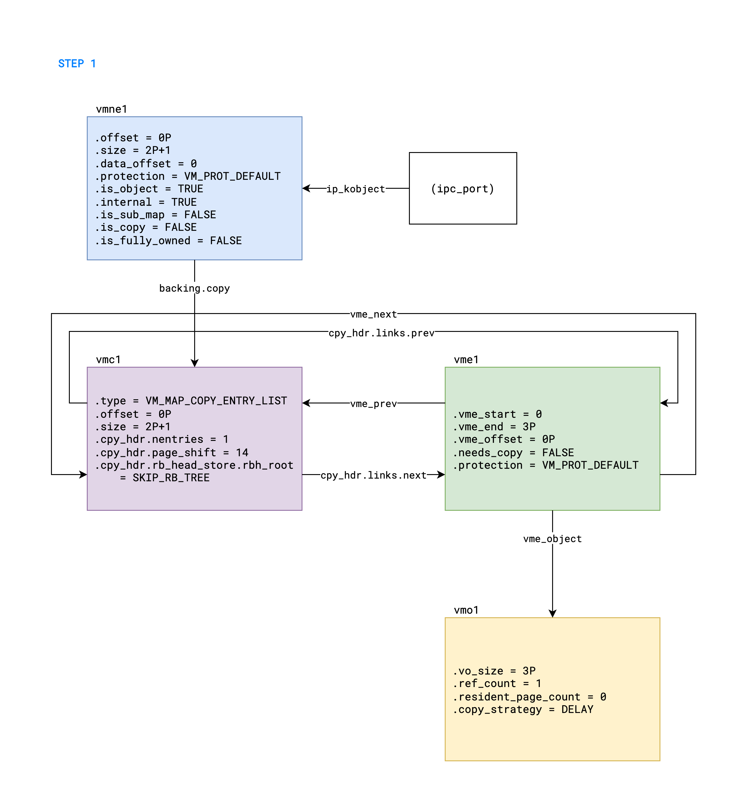
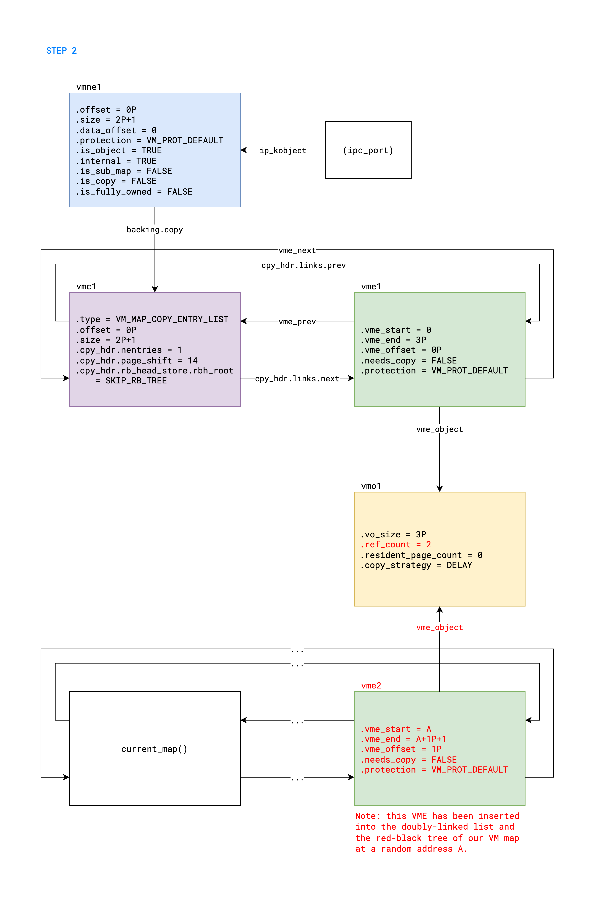
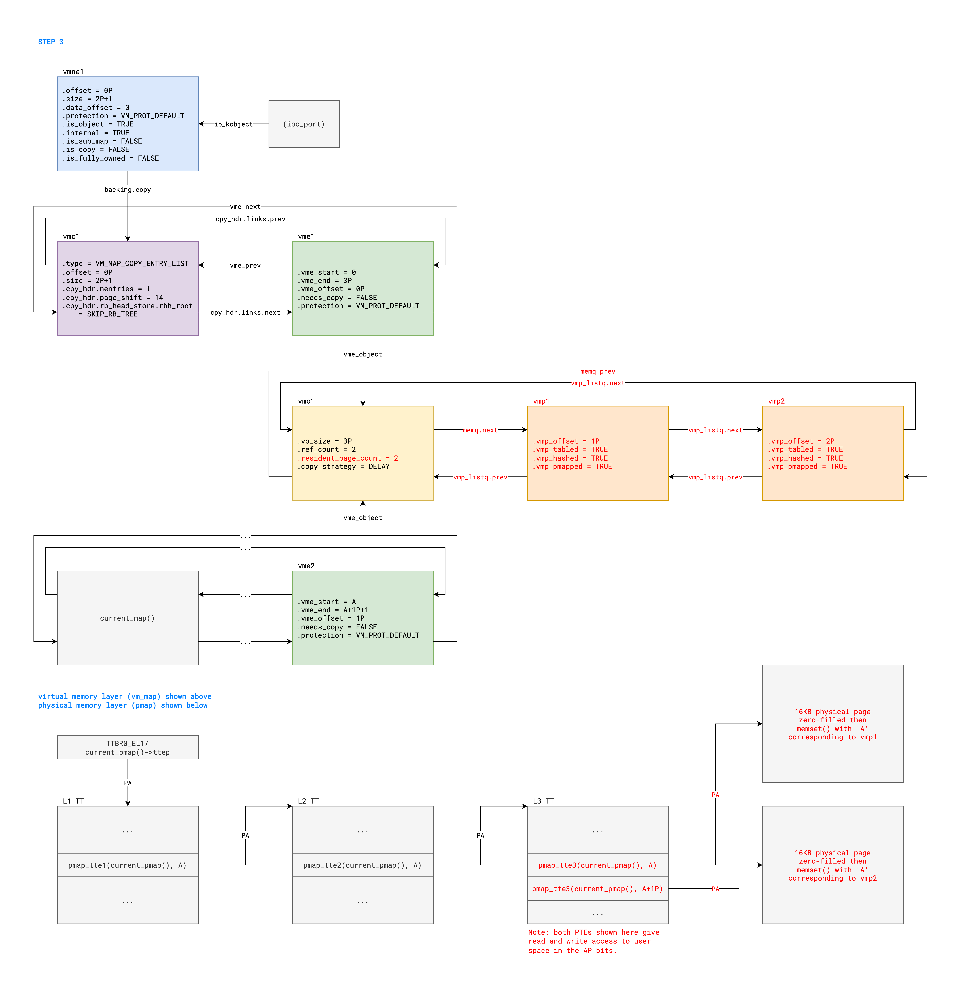
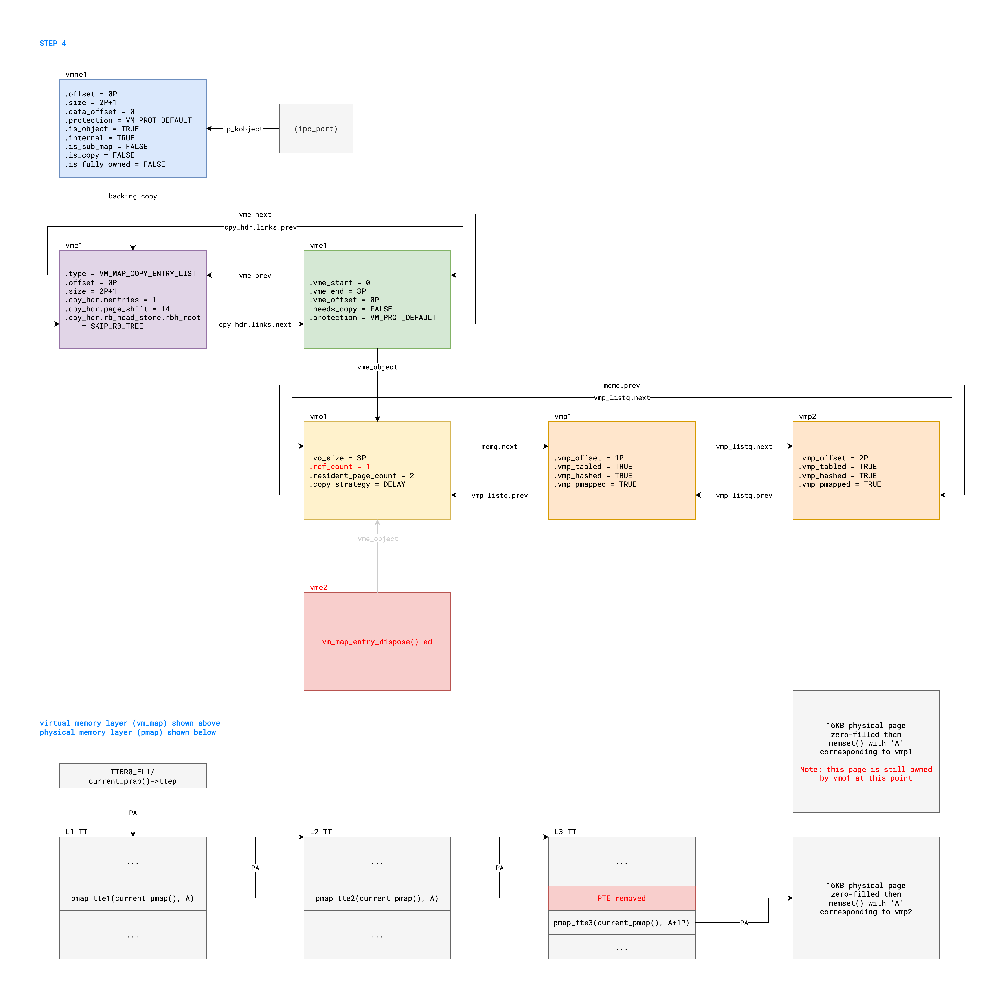
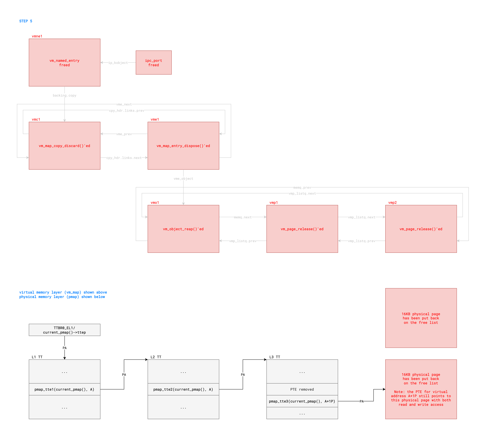
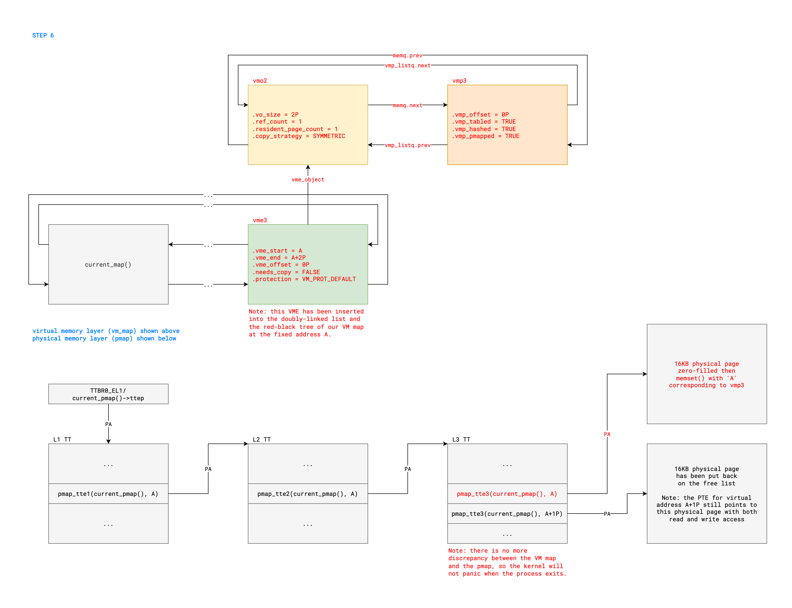

# PhysPuppet

This was the first vulnerability I found leading to dangling PTEs. In my original exploit, as
explained in this [write-up](exploiting-puafs.md), I was inspired by [SockPuppet][1] to reallocate
socket-related objects inside the physical pages. I am grateful to Ned Williamson for the
inspiration, hence the name!

[1]: https://googleprojectzero.blogspot.com/2019/12/sockpuppet-walkthrough-of-kernel.html

---

## Abbreviations

- KRKW: kernel read/write
- PUAF: physical use-after-free
- VMC: `vm_map_copy` structure
- VME: `vm_map_entry` structure
- VMO: `vm_object` structure
- VMP: `vm_page` structure
- VMNE: `vm_named_entry` structure

---

## Table of Contents

- [Introduction](#introduction)
- [Part A: From Vulnerability to PUAF](#part-a-from-vulnerability-to-puaf)
- [Part B: From PUAF to KRKW](#part-b-from-puaf-to-krkw)
- [Part C: From KRKW to Cleanup](#part-c-from-krkw-to-cleanup)

---

## Introduction

This write-up presents an exploit for a vulnerability in the XNU kernel:

- Assigned [CVE-2023-23536][2].
- Fixed in iOS 16.4 and macOS 13.3.
- Reachable from the App Sandbox but not the WebContent sandbox.

The exploit has been successfully tested on:

- iOS 16.1 (iPhone 14 Pro Max)
- macOS 13.0 (MacBook Air M2 2022)

All code snippets shown below are from [xnu-8792.41.9][3].

[2]: https://support.apple.com/en-us/HT213676
[3]: https://github.com/apple-oss-distributions/xnu/tree/xnu-8792.41.9

---

## Part A: From Vulnerability to PUAF

This part of the exploit is made up of 6 steps, which are labeled in the function
`physpuppet_run()`, located in [physpuppet.h](../kfd/libkfd/puaf/physpuppet.h). Each step will be
described in detail below, with figures illustrating the relevant kernel state after each step. Note
that the green boxes represent VMEs, the yellow boxes represent VMOs, the purple boxes represent
VMCs, the blue boxes represent VMNEs, the orange boxes represent VMPs, and the red text highlights
the difference compared to the previous figure. Also, please note that P denotes the page size
(i.e. 16384 bytes). Lastly, before reading the description of each step, please check the
corresponding code in the function `physpuppet_run()`, as it won't be repeated here.

#### STEP 1:

The MIG routine `mach_memory_object_memory_entry_64()` is a pretty simple routine that allows us to
create a named entry with an unaligned size. Note that the returned named entry (`vmne1`) has an
unaligned size, but its internal VME (`vme1`) does have page-aligned start and end addresses. Here
is the code path taken by the MIG routine:

```c
// Location: osfmk/vm/vm_user.c

kern_return_t
mach_memory_object_memory_entry_64(
    host_t                  host,           // host := mach_host_self()
    boolean_t               internal,       // internal := TRUE
    vm_object_offset_t      size,           // size := 2P+1
    vm_prot_t               permission,     // permission := VM_PROT_DEFAULT
    memory_object_t         pager,          // pager := MEMORY_OBJECT_NULL
    ipc_port_t              *entry_handle)
{
    unsigned int            access;
    vm_named_entry_t        user_entry;
    ipc_port_t              user_handle;
    vm_object_t             object;

    if (host == HOST_NULL) { // branch not taken
        ...
    }

    if (pager == MEMORY_OBJECT_NULL && internal) { // branch taken
        /*
         * Note:
         * - vm_object_allocate() rounds up object->vo_size to 3P.
         * - "object" refers to vmo1 in the figures.
         */
        object = vm_object_allocate(size);
        if (object->copy_strategy == MEMORY_OBJECT_COPY_SYMMETRIC) { // branch taken
            object->copy_strategy = MEMORY_OBJECT_COPY_DELAY;
        }
    } else { // branch not taken
        ...
    }
    if (object == VM_OBJECT_NULL) { // branch not taken
        ...
    }

    /*
     * Note:
     * - "user_entry" refers to vmne1 in the figures.
     */
    user_entry = mach_memory_entry_allocate(&user_handle);
    user_entry->size = size;                            // vmne1->size := 2P+1
    user_entry->offset = 0;                             // vmne1->offset := 0P
    user_entry->protection = permission & VM_PROT_ALL;  // vmne1->protection := VM_PROT_DEFAULT
    access = GET_MAP_MEM(permission);
    SET_MAP_MEM(access, user_entry->protection);
    user_entry->is_sub_map = FALSE;

    /*
     * Note:
     * - vm_named_entry_associate_vm_object() will allocate vmc1 and vme1 in the figures.
     * - VME_OBJECT(vme1) will be set to vmo1 and VME_OFFSET(vme1) will be set to 0P.
     * - vme1 will be linked in with vmc1.
     * - vmne1->backing.copy will be set to vmc1.
     */
    vm_named_entry_associate_vm_object(user_entry, object, 0, size,
        (user_entry->protection & VM_PROT_ALL));
    user_entry->internal = object->internal;
    assert(object->internal == internal);
    if (VM_OBJECT_OWNER(object) != TASK_NULL) { // branch not taken
        ...
    }

    *entry_handle = user_handle;
    return KERN_SUCCESS;
}
```

Here is an illustration of the relevant kernel state after step 1:



#### STEP 2:

In this step, we call the `vm_map()` routine to make a mapping of the named entry created in step 1.
However, the arguments are crafted to trigger some weird edge cases that allow us to end up calling
`vm_map_enter()` with an unaligned size of 1P + 1, which will create and insert a new VME (`vme2`)
into our VM map at a random address A, but with an end address of A + 1P + 1. Here is the detailed
code path taken by `vm_map_enter_mem_object_helper()`:

```c
// Location: osfmk/vm/vm_map.c

static kern_return_t
vm_map_enter_mem_object_helper(
    vm_map_t                target_map,         // target_map := current_map()
    vm_map_offset_t         *address,           // *address := 0
    vm_map_size_t           initial_size,       // initial_size := ~0ULL
    vm_map_offset_t         mask,               // mask := 0
    int                     flags,              // flags := (VM_FLAGS_ANYWHERE | VM_FLAGS_RANDOM_ADDR)
    vm_map_kernel_flags_t   vmk_flags,          // ...
    vm_tag_t                tag,                // tag := 0
    ipc_port_t              port,               // port := (ipc_port for vmne1)
    vm_object_offset_t      offset,             // offset := 1P
    boolean_t               copy,               // copy := FALSE
    vm_prot_t               cur_protection,     // cur_protection := VM_PROT_DEFAULT
    vm_prot_t               max_protection,     // max_protection := VM_PROT_DEFAULT
    vm_inherit_t            inheritance,        // inheritance := VM_INHERIT_DEFAULT
    upl_page_list_ptr_t     page_list,          // page_list := NULL
    unsigned int            page_list_count)    // page_list_count := 0
{
    vm_map_address_t        map_addr;
    vm_map_size_t           map_size;
    vm_object_t             object;
    vm_object_size_t        size;
    kern_return_t           result;
    boolean_t               mask_cur_protection, mask_max_protection;
    boolean_t               kernel_prefault, try_prefault = (page_list_count != 0);
    vm_map_offset_t         offset_in_mapping = 0;
#if __arm64__
    boolean_t               fourk = vmk_flags.vmkf_fourk; /* fourk := FALSE */
#endif

    if (VM_MAP_PAGE_SHIFT(target_map) < PAGE_SHIFT) { // branch not taken
        ...
    }

    mask_cur_protection = cur_protection & VM_PROT_IS_MASK; // mask_cur_protection := 0
    mask_max_protection = max_protection & VM_PROT_IS_MASK; // mask_max_protection := 0
    cur_protection &= ~VM_PROT_IS_MASK; // cur_protection := VM_PROT_DEFAULT
    max_protection &= ~VM_PROT_IS_MASK; // max_protection := VM_PROT_DEFAULT

    if ((target_map == VM_MAP_NULL) ||
        (cur_protection & ~(VM_PROT_ALL | VM_PROT_ALLEXEC)) ||
        (max_protection & ~(VM_PROT_ALL | VM_PROT_ALLEXEC)) ||
        (inheritance > VM_INHERIT_LAST_VALID) ||
        (try_prefault && (copy || !page_list)) ||
        initial_size == 0) { // branch not taken
        ...
    }

#if __arm64__
    if (cur_protection & VM_PROT_EXECUTE) { // branch not taken
        ...
    }

    if (fourk && VM_MAP_PAGE_SHIFT(target_map) < PAGE_SHIFT) { // branch not taken
        ...
    }
    if (fourk) { // branch not taken
        ...
    } else
#endif
    {
        map_addr = vm_map_trunc_page(*address,
            VM_MAP_PAGE_MASK(target_map)); // map_addr := 0
        map_size = vm_map_round_page(initial_size,
            VM_MAP_PAGE_MASK(target_map)); // map_size := 0
    }
    size = vm_object_round_page(initial_size); // size := 0

    /*
     * Note:
     * - both "map_size" and "size" have been set to 0 because of an integer overflow.
     */

    if (!IP_VALID(port)) { // branch not taken
        ...
    } else if (ip_kotype(port) == IKOT_NAMED_ENTRY) { // branch taken
        vm_named_entry_t        named_entry;
        vm_object_offset_t      data_offset;

        named_entry = mach_memory_entry_from_port(port); // named_entry := vmne1

        if (flags & (VM_FLAGS_RETURN_DATA_ADDR |
            VM_FLAGS_RETURN_4K_DATA_ADDR)) { // branch not taken
            ...
        } else { // branch taken
            data_offset = 0;
        }

        if (size == 0) { // branch taken
            //      1P >= 2P+1
            if (offset >= named_entry->size) { // branch not taken
                ...
            }
            size = named_entry->size - offset; // size := (2P+1)-(1P) = 1P+1
        }
        if (mask_max_protection) { // branch not taken
            ...
        }
        if (mask_cur_protection) { // branch not taken
            ...
        }
        if ((named_entry->protection & max_protection) !=
            max_protection) { // branch not taken
            ...
        }
        if ((named_entry->protection & cur_protection) !=
            cur_protection) { // branch not taken
            ...
        }

        //      1P + 1P+1 < 1P
        if (offset + size < offset) { // branch not taken
            ...
        }
        //               2P+1 < (1P     + 0xffffffffffffffff)
        if (named_entry->size < (offset + initial_size)) { // branch not taken
            ...
        }

        if (named_entry->is_copy) { // branch not taken
            ...
        }

        offset = offset + named_entry->offset; // offset := 1P + 0P = 1P

        /*
         * Note:
         * - "map_size" is set to 1P+1 here, which is what we will pass to vm_map_enter().
         */
        if (!VM_MAP_PAGE_ALIGNED(size,
            VM_MAP_PAGE_MASK(target_map))) { // branch taken
            map_size = size; // map_size := 1P+1
        }

        named_entry_lock(named_entry);
        if (named_entry->is_sub_map) { // branch not taken
            ...
        } else if (named_entry->is_copy) { // branch not taken
            ...
        }

        if (named_entry->is_object) { // branch taken
            ...

            object = vm_named_entry_to_vm_object(named_entry); // object := vmo1
            assert(object != VM_OBJECT_NULL);
            vm_object_lock(object);
            named_entry_unlock(named_entry);

            vm_object_reference_locked(object); // vmo1->ref_count := 2

            ...

            vm_object_unlock(object);
        } else { // branch not taken
            ...
        }
    } else if (ip_kotype(port) == IKOT_MEMORY_OBJECT) { // branch not taken
        ...
    } else { // branch not taken
        ...
    }

    if (object != VM_OBJECT_NULL &&
        object->named && // object->named == FALSE
        object->pager != MEMORY_OBJECT_NULL &&
        object->copy_strategy != MEMORY_OBJECT_COPY_NONE) { // branch not taken
        ...
    }

    if (copy) { // branch not taken because copy == FALSE
        ...
    }

    // kernel_prefault := FALSE
    kernel_prefault = (try_prefault && vm_kernel_map_is_kernel(target_map));
    vmk_flags.vmkf_keep_map_locked = (try_prefault && !kernel_prefault);

#if __arm64__
    if (fourk) { // branch not taken
        ...
    } else
#endif
    {
        /*
         * Note:
         * - We end up calling vm_map_enter() with map_size equal to 1P + 1.
         */
        result = vm_map_enter(
            target_map,             // current_map()
            &map_addr,              // 0
            map_size,               // 1P+1
            (vm_map_offset_t)mask,  // 0
            flags,                  // (VM_FLAGS_ANYWHERE | VM_FLAGS_RANDOM_ADDR)
            vmk_flags,              // ...
            tag,                    // 0
            object,                 // vmo1
            offset,                 // 1P
            copy,                   // FALSE
            cur_protection,         // VM_PROT_DEFAULT
            max_protection,         // VM_PROT_DEFAULT
            inheritance);           // VM_INHERIT_DEFAULT
    }
    if (result != KERN_SUCCESS) { // branch not taken because result == KERN_SUCCESS
        ...
    }


    if (result == KERN_SUCCESS && try_prefault) { // branch not taken because try_prefault == FALSE
        ...
    }

    if (flags & (VM_FLAGS_RETURN_DATA_ADDR |
        VM_FLAGS_RETURN_4K_DATA_ADDR)) { // branch not taken
        ...
    } else { // branch taken
        *address = map_addr; // *address := A
    }
    return result;
}
```

Here is an illustration of the relevant kernel state after step 2:



#### STEP 3:

After step 2, we have an unaligned VME (`vme2`) linked in our VM map. In step 3, we simply fault in
the 2 pages covered by `vme2`. Note that even if a fault occurs at address A + 1P + PAGE_MASK,
`vm_fault_internal()` truncates the fault address to A + 1P, such that the lookup performed in
`vm_map_lookup_and_lock_object()` still successfully returns `vme2`. Indeed, the lookup routine will
eventually end up in `vm_map_store_lookup_entry_rb()`. Since A + 1P is greater than or equal to
`vme2->vme_start` (i.e. A) and strictly smaller than `vme2->vme_end` (i.e. A + 1P + 1), it returns
`TRUE` with `vme2` as the `vm_entry` out parameter. Note that `VME_OFFSET(vme2)` is equal to 1P,
such that the `offset` out parameter of `vm_map_lookup_and_lock_object()` will be 1P during the
first fault and 2P during the second fault. Next, `vm_fault_internal()` calls `vm_page_lookup()`,
which will fail to find the corresponding page in `vmo1`. Therefore, a page must be grabbed from the
free list and zero-filled. During the first fault, `vmp1` is inserted into `vmo1` at an offset of
1P, and then `VM_PAGE_GET_PHYS_PAGE(vmp1)` is inserted into the PTE for virtual address A with both
read and write permissions. During the second fault, `vmp2` is inserted into `vmo1` at an offset of
2P, and then `VM_PAGE_GET_PHYS_PAGE(vmp2)` is inserted into the PTE for virtual address A + 1P, once
again with both read and write permissions.

Here is an illustration of the relevant kernel state after step 3:



#### STEP 4:

In this step, we simply call `vm_deallocate()` to unmap the virtual address range covered by `vme2`,
which is done by `vm_map_delete()`. Here is the detailed code path of that function:

```c
// Location: osfmk/vm/vm_map.c

static kmem_return_t
vm_map_delete(
    vm_map_t                map,        // map := current_map()
    vm_map_offset_t         start,      // start := A
    vm_map_offset_t         end,        // end := A+2P
    vmr_flags_t             flags,      // flags := VM_MAP_REMOVE_NO_FLAGS
    kmem_guard_t            guard,      // guard := KMEM_GUARD_NONE
    vm_map_zap_t            zap_list)
{
    vm_map_entry_t          entry, next;
    int                     interruptible;
    vm_map_offset_t         gap_start = 0;
    vm_map_offset_t         clear_in_transition_end = 0;
    __unused vm_map_offset_t save_start = start;
    __unused vm_map_offset_t save_end = end;
    vm_map_delete_state_t   state = VMDS_NONE;
    kmem_return_t           ret = { };

    if (vm_map_pmap(map) == kernel_pmap) { // branch not taken
        ...
    }

    if (map->terminated || os_ref_get_count_raw(&map->map_refcnt) == 0) { // branch not taken
        ...
    }

    interruptible = (flags & VM_MAP_REMOVE_INTERRUPTIBLE) ?
        THREAD_ABORTSAFE : THREAD_UNINT; // interruptible := THREAD_UNINT

    if ((flags & VM_MAP_REMOVE_NO_MAP_ALIGN) == 0 &&
        (start & VM_MAP_PAGE_MASK(map))) { // branch not taken
        ...
    }

    if ((state & VMDS_GAPS_OK) == 0) { // branch taken
        if (end == 0 || end > vm_map_max(map)) { // branch not taken
            ...
        }

        if (end < start) { // branch not taken
            ...
        }

        if (start < vm_map_min(map)) { // branch not taken
            ...
        }
    } else { // branch not taken
        ...
    }

    // entry := vme2
    while (vm_map_lookup_entry_or_next(map, start, &entry)) {
        if (entry->superpage_size && (start & ~SUPERPAGE_MASK)) { // branch not taken
            ...
        } else { // branch taken
            SAVE_HINT_MAP_WRITE(map, entry->vme_prev);
            break;
        }
    }

    if (entry->superpage_size) { // branch not taken
        ...
    }

    for (vm_map_offset_t s = start; s < end;) { // s := A
        if (state & VMDS_NEEDS_LOOKUP) { // branch not taken
            ...
        }

        if (clear_in_transition_end) { // branch not taken
            ...
        }

        if (entry == vm_map_to_entry(map) || s < entry->vme_start) { // branch not taken
            ...
        }

        if (state & VMDS_KERNEL_PMAP) { // branch not taken
            ...
        }

        if (entry->vme_permanent && entry->is_sub_map) { // branch not taken
            ...
        }

        if (entry->vme_start < s) { // branch not taken
            ...
        }

        if (end < entry->vme_end) { // branch not taken
            ...
        }

        if (entry->vme_permanent && entry->is_sub_map) { // branch not taken
            ...
        }

        assert(s == entry->vme_start);
        assert(entry->vme_end <= end);

        if (entry->in_transition) { // branch not taken
            ...
        }

        if (entry->wired_count) { // branch not taken
            ...
        }

        assert(entry->wired_count == 0);
        assert(entry->user_wired_count == 0);

        if (!entry->vme_permanent) { // branch taken
            /*
             * Typical case: the entry really shouldn't be permanent
             */
        } else if ((flags & VM_MAP_REMOVE_IMMUTABLE_CODE) &&
            (entry->protection & VM_PROT_EXECUTE) &&
            developer_mode_state()) { // branch not taken
            ...
        } else if ((flags & VM_MAP_REMOVE_IMMUTABLE) || map->terminated) { // branch not taken
            ...
        } else { // branch not taken
            ...
        }

        if (entry->is_sub_map) { // branch not taken
            ...
        } else if (entry->vme_kernel_object ||
            VME_OBJECT(entry) == compressor_object) { // branch not taken
            ...
        } else if (map->mapped_in_other_pmaps &&
            os_ref_get_count_raw(&map->map_refcnt) != 0) { // branch not taken
            ...
        } else if ((VME_OBJECT(entry) != VM_OBJECT_NULL) ||
            (state & VMDS_KERNEL_PMAP)) { // branch taken
            /*
             * Note:
             * - pmap_remove_options() is responsible to clear the PTEs covered by this VME.
             */
            pmap_remove_options(map->pmap,  // current_pmap()
                (addr64_t)entry->vme_start, // A
                (addr64_t)entry->vme_end,   // A+1P+1
                PMAP_OPTIONS_REMOVE);
        }

        if (entry->iokit_acct) { // branch not taken
            ...
        }

        s = entry->vme_end; // s := A+1P+1
        next = entry->vme_next;
        ret.kmr_size += entry->vme_end - entry->vme_start;

        if (entry->vme_permanent) { // branch not taken
            ...
        } else { // branch taken
            /*
             * Note:
             * - vme2 is unlinked from the doubly-linked list and red-black tree here.
             */
            vm_map_entry_zap(map, entry, zap_list);
        }

        entry = next;

        ...

        /*
         * Note:
         * - The next VME is outside the unmapped VA range, so we will exit this loop.
         */
    }

    ...

    return ret;
}
```

In short, `pmap_remove_options()` is called for the VA range of `vme2`. Crucially, the end address
of `vme2` is unaligned at this point, but unfortunately, `pmap_remove_options()` only checks for
that condition inside the `MACH_ASSERT` macro for debug and development builds. Finally, the PPL
routine `pmap_remove_options_internal()` gets called, but the unaligned "page offset" of the end
address is shifted off, such that only the first of the two PTEs gets cleared, as shown in the
following snippet:

```c
// Location: osfmk/arm/pmap/pmap.c

MARK_AS_PMAP_TEXT vm_map_address_t
pmap_remove_options_internal(
    pmap_t pmap,            // pmap := current_pmap()
    vm_map_address_t start, // start := A
    vm_map_address_t end,   // end := A+1P+1
    int options)            // options := PMAP_OPTIONS_REMOVE
{
    vm_map_address_t eva = end; // eva := A+1P+1
    pt_entry_t     *bpte, *epte;
    pt_entry_t     *pte_p;
    tt_entry_t     *tte_p;
    int             remove_count = 0;
    bool            need_strong_sync = false;
    bool            unlock = true;

    if (__improbable(end < start)) { // branch not taken
        ...
    }

    validate_pmap_mutable(pmap);

    __unused const pt_attr_t * const pt_attr = pmap_get_pt_attr(pmap);

    pmap_lock(pmap, PMAP_LOCK_EXCLUSIVE);

    tte_p = pmap_tte(pmap, start); // tte_p := pointer to L2 TTE

    if (tte_p == (tt_entry_t *) NULL) { // branch not taken
        ...
    }

    if ((*tte_p & ARM_TTE_TYPE_MASK) == ARM_TTE_TYPE_TABLE) {
        pte_p = (pt_entry_t *) ttetokv(*tte_p); // pte_p := pointer to L3 TT
        bpte = &pte_p[pte_index(pt_attr, start)]; // bpte := pointer to first PTE
        epte = bpte + ((end - start) >> pt_attr_leaf_shift(pt_attr)); // epte := pointer to second PTE

        /*
         * Note:
         * - The difference of (end - start) is 1P+1, but becomes 1P after being shifted right,
         *   such that the end result is the same as if "end" had simply been A+1P.
         * - Therefore, only the first PTE for virtual address A gets removed.
         */

        if (__improbable((pmap->type != PMAP_TYPE_KERNEL) && (ptep_get_pmap(bpte) != pmap))) {
            ...
        }

        remove_count = pmap_remove_range_options(pmap, start, bpte, epte, &eva,
            &need_strong_sync, options);

        if ((pmap->type == PMAP_TYPE_USER) && (ptep_get_info(pte_p)->refcnt == 0)) {
            ...
        }
    }

done:
    if (unlock) {
        pmap_unlock(pmap, PMAP_LOCK_EXCLUSIVE);
    }

    if (remove_count > 0) {
        PMAP_UPDATE_TLBS(pmap, start, eva, need_strong_sync, true);
    }
    return eva;
}
```

Note that after `vm_map_delete()` returns, `vm_map_remove_and_unlock()` will also call
`vm_map_zap_dispose()`, which will deallocate `vme2` and drop the reference count of `vmo1` to 1.

Here is an illustration of the relevant kernel state after step 4:



#### STEP 5:

In this step, we call `mach_port_deallocate()` to deallocate the port returned in step 1, namely for
`vmne1`. This will cause the deallocation of all structures associated with the named entry.
However, since it was holding the last reference on `vmo1`, this will trigger `vm_object_reap()`,
which will put both of its pages, `vmp1` and `vmp2`, back on the free list without calling
`pmap_disconnect()`. However, we still have a dangling PTE on the physical page referred to by
`vmp2`, with both read and write permissions.

Here is an illustration of the relevant kernel state after step 5:



#### STEP 6:

Great, we have successfully achieved a PUAF primitive. However, if the rest of the exploit goes
wrong and our process suddenly exits, we would get a "Found inconsistent state in soon to be deleted
L%d table" kernel panic. That is because there is now a discrepancy between the state of our VM map
and the state of our pmap. Indeed, we have a PTE for the virtual address A + 1P in the pmap, but
there is no corresponding VME in our VM map. In that case, when the process exits, PPL rightfully
detects that this is abnormal and chooses death over dishonor. In order to prevent that, we can
simply call `vm_allocate()` to create another VME (`vme3`) that covers the VA range of both original
PTEs. However, it is important to initialize `VME_OBJECT(vme3)` to a non-null value, otherwise
`pmap_remove_options()` won't get called when `vme3` is deleted, as can be seen from the snippet for
`vm_map_delete()` shown previously. This is easily achieved by faulting in the first page of `vme3`,
which will allocate a new object (`vmo2`), populate it with a new zero-filled page (`vmp3`), and
enter the physical address of that page into the PTE for virtual address A. Of course, we don't want
to fault in the second page, which would overwrite the dangling PTE.

Here is an illustration of the relevant kernel state after step 6:



And voilà! We now have a stable PUAF primitive on a single physical page. We can then repeat this
entire procedure as many times as necessary in order to obtain an arbitrary number of PUAF pages.

---

## Part B: From PUAF to KRKW

This part of the exploit is shared across all PUAF exploits, so please check the write-up about
[exploiting PUAFs](exploiting-puafs.md) for more details.

---

## Part C: From KRKW to Cleanup

This exploit does not corrupt the kernel state such that it needs to be cleaned up post-KRKW in
order to prevent a kernel panic.
