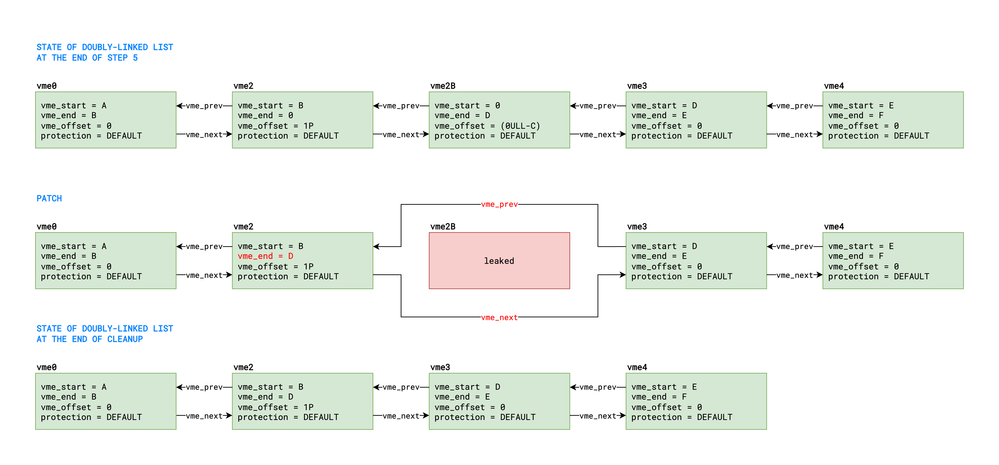
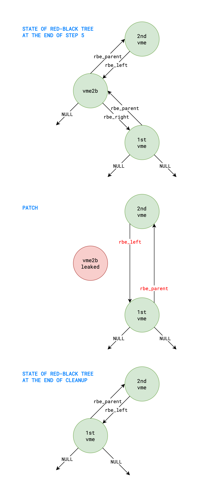

# Smith

> I don't fully understand how it happened, perhaps some part of you imprinted on to me.           \
> Something overwritten or copied. It is at this point irrelevant.                                 \
> What matters is that whatever happened, happened for a reason.

Agent Smith - The Matrix Reloaded

---

## Abbreviations

- KRKW: kernel read/write
- PUAF: physical use-after-free
- VMC: `vm_map_copy` structure
- VME: `vm_map_entry` structure
- VMO: `vm_object` structure

---

## Table of Contents

- [Introduction](#introduction)
- [Part A: From Vulnerability to PUAF](#part-a-from-vulnerability-to-puaf)
- [Part B: From PUAF to KRKW](#part-b-from-puaf-to-krkw)
- [Part C: From KRKW to Cleanup](#part-c-from-krkw-to-cleanup)
- [Appendix A: Considerations for Setup](#appendix-a-considerations-for-setup)
- [Appendix B: Hacky Proof of Determinism](#appendix-b-hacky-proof-of-determinism)

---

## Introduction

This write-up presents an exploit for a vulnerability in the XNU kernel:

- Assigned [CVE-2023-32434][1].
- Fixed in iOS 16.5.1 and macOS 13.4.1.
- Reachable from the WebContent sandbox and might have been actively exploited.
- Note that this CVE fixed multiple integer overflows, so it is unclear whether or not the integer
  overflow used in my exploit was also used in-the-wild. Moreover, if it was, it might not have been
  exploited in the same way.

The exploit has been successfully tested on:

- iOS 16.3, 16.3.1, 16.4 and 16.5 (iPhone 14 Pro Max)
- macOS 13.1 and 13.4 (MacBook Air M2 2022)

All code snippets shown below are from [xnu-8792.81.2][2].

[1]: https://support.apple.com/en-us/HT213814
[2]: https://github.com/apple-oss-distributions/xnu/tree/xnu-8792.81.2

---

## Part A: From Vulnerability to PUAF

This part of the exploit is made up of 5 steps, which are labeled in the function `smith_run()`,
located in [smith.h](../kfd/libkfd/puaf/smith.h). Each step will be described in detail, but first,
here is an illustration of the relevant kernel state after each step. Note that the green boxes
represent VMEs, the yellow boxes represent VMOs, and the red text highlights the difference compared
to the previous step.

Also, please note:

- Before reading the description for each step, check the corresponding code in the function
  `smith_run()`, as it won't be repeated here.
- After reading the description for each step, come back to this image to make sure it matches your
  understanding of the kernel state.


#### STEP 1:

This step happens before we trigger the vulnerability in step 2 and is partially responsible for the
setup. Please note that the rest of the setup, which focuses strictly on reliability, is discussed
at length in [Appendix A](#appendix-a-considerations-for-setup). Here, we simply allocate 5
adjacent VMEs, referred to as `vme0` to `vme4` in the image above, with the following attributes:

- The size of `vme0` and `vme2` is 1 page.
- The size of `vme1` is X pages, where X is the desired number of PUAF pages and must be at least 2.
- The size of `vme3` is equal to the size of `vme1` and `vme2`, i.e. (X+1) pages.
- The size of `vme4` is equal to the size of `vme0` and `vme3`, i.e. (X+2) pages.
- The first 3 VMEs are allocated in decreasing address order to avoid `vm_object_coalesce()` in
  `vm_map_enter()`.
- The last 2 VMEs are initialized to own a VMO with a `copy_strategy` of `MEMORY_OBJECT_COPY_NONE`,
  by using the flag `VM_FLAGS_PURGABLE`.

Optionally, we could also fault in the VA range of `vme3` and `vme4`, in order to pre-populate
`vmo0` and `vmo1`, respectively. This isn't necessary, but it would slightly reduce the duration of
the critical section by avoiding the need to zero-fill (2X+3) pages during step 3 and step 5.

#### STEP 2:

At a high-level, this step is made up of 2 substeps. In substep 2A, we trigger the vulnerability in
`vm_map_copyin_internal()`, which will clip the end of `vme2` to 0, and also allocate another VME
(i.e. `vme2a`) that starts at 0. However, at this point, `vm_map_copyin_internal()` would enter an
infinite loop that keeps allocating VMEs until it reaches a zone exhaustion panic. Therefore, before
calling `vm_copy()`, we spawn 4 threads that call `vm_protect()` at address 0 in a busy-loop. These
threads won't do anything until the vulnerability is triggered in the main thread. In substep 2B,
after `vme2a` has been inserted into our VM map, one of those 4 threads will clip the end of `vme2a`
to 1P (i.e. `PAGE_SIZE`), change its `protection` to `VM_PROT_WRITE`, and also allocate yet another
VME (i.e. `vme2b`) that starts at 1P. Meanwhile, back in the main thread, `vm_map_copyin_internal()`
will take back the map lock and lookup `vme2a` at address 0. But because its new `protection` is
missing `VM_PROT_READ`, it will exit with `KERN_PROTECTION_FAILURE`.

Here is the detailed description of the code path in `vm_map_copyin_internal()`, which is called by
`vm_copy()` from the main thread:

```c
kern_return_t
vm_map_copyin_internal(
    vm_map_t         src_map,  // src_map == current_map()
    vm_map_address_t src_addr, // src_addr == C
    vm_map_size_t    len,      // len == (0ULL-C-1)
    int              flags,    // flags == 0
    vm_map_copy_t    *copy_result)
{
    vm_map_entry_t   tmp_entry;
    vm_map_entry_t   new_entry = VM_MAP_ENTRY_NULL;
    vm_map_offset_t  src_start;
    vm_map_offset_t  src_end;
    vm_map_offset_t  src_base;
    vm_map_t         base_map = src_map;
    boolean_t        map_share = FALSE;
    submap_map_t     *parent_maps = NULL;
    vm_map_copy_t    copy;
    vm_map_address_t copy_addr;
    vm_map_size_t    copy_size;
    boolean_t        src_destroy;
    boolean_t        use_maxprot;
    boolean_t        preserve_purgeable;
    boolean_t        entry_was_shared;
    vm_map_entry_t   saved_src_entry;

    if (flags & ~VM_MAP_COPYIN_ALL_FLAGS) { // branch not taken
        ...
    }

    src_destroy = (flags & VM_MAP_COPYIN_SRC_DESTROY) ? TRUE : FALSE; // src_destroy := FALSE
    use_maxprot = (flags & VM_MAP_COPYIN_USE_MAXPROT) ? TRUE : FALSE; // use_maxprot := FALSE
    preserve_purgeable = (flags & VM_MAP_COPYIN_PRESERVE_PURGEABLE) ? TRUE : FALSE; // preserve_purgeable := FALSE

    if (len == 0) { // branch not taken
        ...
    }

    src_end = src_addr + len; // src_end := (0ULL-1)
    if (src_end < src_addr) { // branch not taken, because no overflow occured at this point
        ...
    }

    /*
     * (0)
     * @note:
     * This trigger the integer overflow that can be considered the "root cause" vulnerability.
     */
    src_start = vm_map_trunc_page(src_addr, VM_MAP_PAGE_MASK(src_map)); // src_start := C
    src_end = vm_map_round_page(src_end, VM_MAP_PAGE_MASK(src_map)); // src_end := 0

    if ((len <= msg_ool_size_small) &&
        (!use_maxprot) &&
        (!preserve_purgeable) &&
        (!(flags & VM_MAP_COPYIN_ENTRY_LIST)) &&
        ((src_start >= vm_map_min(src_map)) &&
         (src_start < vm_map_max(src_map)) &&
         (src_end >= vm_map_min(src_map)) &&
         (src_end < vm_map_max(src_map)))) { // branch not taken, because (len > msg_ool_size_small)
        ...
    }

    copy = vm_map_copy_allocate();
    copy->type = VM_MAP_COPY_ENTRY_LIST;
    copy->cpy_hdr.entries_pageable = TRUE;
    copy->cpy_hdr.page_shift = (uint16_t)(VM_MAP_PAGE_SHIFT(src_map));
    vm_map_store_init(&(copy->cpy_hdr));
    copy->offset = src_addr;
    copy->size = len;

    /*
     * (1)
     * @note:
     * Here, new_entry is initialized with a temporary VME, so it's not NULL.
     */
    new_entry = vm_map_copy_entry_create(copy);

    ...

    vm_map_lock(src_map); // take the map lock

    if (!vm_map_lookup_entry(src_map, src_addr, &tmp_entry)) { // branch not taken, tmp_entry := vme2
        ...
    }

    if (!tmp_entry->is_sub_map) { // branch taken
        vm_map_clip_start(src_map, tmp_entry, src_start); // no clipping because (src_start == tmp_entry->vme_start)
    }

    if (src_start < tmp_entry->vme_start) { // branch not taken, because (src_start == tmp_entry->vme_start)
        ...
    }

    copy_addr = src_start; // copy_addr := C

    while (TRUE) {
        vm_map_entry_t     src_entry = tmp_entry; // src_entry := vme2 (1st iteration); src_entry := vme2a (2nd iteration)
        vm_map_size_t      src_size;
        vm_object_t        src_object;
        vm_object_offset_t src_offset;
        vm_object_t        new_copy_object;
        boolean_t          src_needs_copy;
        boolean_t          new_entry_needs_copy;
        boolean_t          was_wired;
        boolean_t          saved_used_for_jit;
        vm_map_version_t   version;
        kern_return_t      result;

        while (tmp_entry->is_sub_map) { // branch not taken
            ...
        }

        if ((VME_OBJECT(tmp_entry) != VM_OBJECT_NULL) &&
            (VME_OBJECT(tmp_entry)->phys_contiguous)) { // branch not taken
            ...
        }

        /*
         * (2)
         * @note:
         * For the 1st iteration, new_entry is not NULL because it was initialized at (1).
         *
         * (6)
         * @note:
         * For the 2nd iteration, new_entry is NULL because it was updated at (5).
         */
        if (new_entry == VM_MAP_ENTRY_NULL) { // branch not taken for the 1st iteration, but taken for the 2nd iteration
            version.main_timestamp = src_map->timestamp;
            vm_map_unlock(src_map); // release the map lock
            new_entry = vm_map_copy_entry_create(copy);
            vm_map_lock(src_map); // take back the map lock

            /*
             * (7)
             * @note:
             * This timestamp comparison fails because one or more of the 4 spinner threads will have taken the map lock.
             * Also, note that src_start is no longer equal to C, but is now equal to 0 because it was updated at (5).
             */
            if ((version.main_timestamp + 1) != (src_map->timestamp)) { // branch taken
                if (!vm_map_lookup_entry(src_map, src_start, &tmp_entry)) { // branch not taken, tmp_entry := vme2a
                    ...
                }
                if (!tmp_entry->is_sub_map) { // branch taken
                    vm_map_clip_start(src_map, tmp_entry, src_start); // no clipping because (src_start == tmp_entry->vme_start)
                }
                continue;
            }
        }

        /*
         * (3)
         * @note:
         * For the 1st iteration, vme2->protection == VM_PROT_DEFAULT, so the check succeeds.
         *
         * (8)
         * @note:
         * For the 2nd iteration, vme2a->protection == VM_PROT_WRITE, so the check fails.
         * Finally, vm_map_copyin_internal() returns KERN_PROTECTION_FAILURE.
         */
        if ((((src_entry->protection & VM_PROT_READ) == VM_PROT_NONE) && (!use_maxprot)) ||
            ((src_entry->max_protection & VM_PROT_READ) == 0)) { // branch not taken for the 1st iteration, but taken for the 2nd iteration
            RETURN(KERN_PROTECTION_FAILURE);
        }

        /*
         * (4)
         * @note:
         * This clips the end of vme2 to 0, which now has a VA range of [C,0).
         * This also allocates and inserts vme2a, which has a VA range of [0,D).
         */
        vm_map_clip_end(src_map, src_entry, src_end);

        src_size = src_entry->vme_end - src_start; // src_size := (0ULL-C)
        src_object = VME_OBJECT(src_entry); // src_object := NULL
        src_offset = VME_OFFSET(src_entry); // src_offset := 0
        was_wired = (src_entry->wired_count != 0); // was_wired := FALSE

        vm_map_entry_copy(src_map, new_entry, src_entry);

        if (new_entry->is_sub_map) { // branch not taken
            ...
        } else { // branch taken
            ...
            assert(!new_entry->iokit_acct);
            new_entry->use_pmap = TRUE;
        }

RestartCopy:
        if (((src_object == VM_OBJECT_NULL) ||
             ((!was_wired) &&
              (!map_share )&&
              (!tmp_entry->is_shared) &&
              (!((debug4k_no_cow_copyin) && (VM_MAP_PAGE_SHIFT(src_map) < PAGE_SHIFT))))) &&
            (vm_object_copy_quickly(VME_OBJECT(new_entry), src_offset, src_size, &src_needs_copy, &new_entry_needs_copy))) { // branch taken
            new_entry->needs_copy = new_entry_needs_copy;

            if ((src_needs_copy) && (!tmp_entry->needs_copy)) { // branch not taken, because (src_needs_copy == FALSE)
                ...
            }

            goto CopySuccessful;
        }

        ...

CopySuccessful:
        vm_map_copy_entry_link(copy, vm_map_copy_last_entry(copy), new_entry);

        /*
         * (5)
         * @note:
         * Here, src_start is updated to 0 and new_entry is updated to NULL.
         */
        src_base = src_start; // src_base := C
        src_start = new_entry->vme_end; // src_start := 0
        new_entry = VM_MAP_ENTRY_NULL;

        while ((src_start >= src_end) && (src_end != 0)) { // branch not taken, because (src_end == 0)
            ...
        }

        if ((VM_MAP_PAGE_SHIFT(src_map) != PAGE_SHIFT) &&
            (src_start >= src_addr + len) &&
            (src_addr + len != 0)) { // branch not taken
            ...
        }

        if ((src_start >= src_end) && (src_end != 0)) { // branch not taken, because (src_end == 0)
            ...
        }

        tmp_entry = src_entry->vme_next; // tmp_entry := vme2a

        if ((tmp_entry->vme_start != src_start) ||
            (tmp_entry == vm_map_to_entry(src_map))) { // branch not taken... so go back to the top of the while loop
            ...
        }
    }

    ...
}
```

And here is the detailed description of the code path in `vm_map_protect()`, which is called by
`vm_protect()` from the 4 spinner threads:

```c
kern_return_t
vm_map_protect(
    vm_map_t        map,      // map == current_map()
    vm_map_offset_t start,    // start == 0
    vm_map_offset_t end,      // end == 1P
    vm_prot_t       new_prot, // new_prot == VM_PROT_WRITE
    boolean_t       set_max)  // set_max == FALSE
{
    vm_map_entry_t  current;
    vm_map_offset_t prev;
    vm_map_entry_t  entry;
    vm_prot_t       new_max;
    int             pmap_options = 0;
    kern_return_t   kr;

    if (new_prot & VM_PROT_COPY) { // branch not taken
        ...
    }

    vm_map_lock(map); // take the map lock

    if (start >= map->max_offset) { // branch not taken
        ...
    }

    while (1) {
        /*
         * (0)
         * @note:
         * Before the main thread triggers the vulnerability in vm_map_copyin_internal(),
         * this lookup at address 0 fails and vm_map_protect() returns KERN_INVALID_ADDRESS.
         * However, after the bad clip, the lookup succeeds and entry := vme2a, which has a VA range of [0,D).
         */
        if (!vm_map_lookup_entry(map, start, &entry)) { // branch taken before bad clip, but not taken after
            vm_map_unlock(map);
            return KERN_INVALID_ADDRESS;
        }

        if ((entry->superpage_size) && (start & (SUPERPAGE_SIZE - 1))) { // branch not taken
            ...
        }

        break;
    }

    if (entry->superpage_size) { // branch not taken
        ...
    }

    current = entry; // current := vme2a
    prev = current->vme_start; // prev := 0

    while ((current != vm_map_to_entry(map)) && (current->vme_start < end)) { // branch taken (1 iteration)
        if (current->vme_start != prev) { // branch not taken
            ...
        }

        new_max = current->max_protection; // new_max := VM_PROT_ALL

        if ((new_prot & new_max) != new_prot) { // branch not taken
            ...
        }

        if ((current->used_for_jit) &&
            (pmap_has_prot_policy(map->pmap, current->translated_allow_execute, current->protection))) { // branch not taken
            ...
        }

        if (current->used_for_tpro) { // branch not taken
            ...
        }


        if ((new_prot & VM_PROT_WRITE) &&
            (new_prot & VM_PROT_ALLEXEC) &&
            ...
            (!(current->used_for_jit))) { // branch not taken
            ...
        }

        if (map->map_disallow_new_exec == TRUE) { // branch not taken
            ...
        }

        prev = current->vme_end; // prev := D
        current = current->vme_next; // current := vme3, which has a VA range of [D,E)... so exit the while loop
    }

    if ((end > prev) &&
        (end == vm_map_round_page(prev, VM_MAP_PAGE_MASK(map)))) { // branch not taken, because (end < prev)
        ...
    }

    if (end > prev) { // branch not taken, because (end < prev)
        ...
    }

    current = entry; // current := vme2a

    if (current != vm_map_to_entry(map)) { // branch taken
        vm_map_clip_start(map, current, start); // no clipping because (start == current->vme_start)
    }

    while ((current != vm_map_to_entry(map)) && (current->vme_start < end)) { // branch taken (1 iteration)
        vm_prot_t old_prot;

        /*
         * (1)
         * @note:
         * This clips the end of vme2a to 1P, which now has a VA range of [0,1P).
         * This also allocates and inserts vme2b, which has a VA range of [1P,D).
         */
        vm_map_clip_end(map, current, end);

        if (current->is_sub_map) { // branch not taken
            ...
        }

        old_prot = current->protection; // old_prot := VM_PROT_DEFAULT

        if (set_max) { // branch not taken
            ...
        } else {
            current->protection = new_prot; // vme2a->protection := VM_PROT_WRITE
        }

        if (current->protection != old_prot) { // branch taken
            vm_prot_t prot;

            prot = current->protection; // prot := VM_PROT_WRITE
            if ((current->is_sub_map) ||
                (VME_OBJECT(current) == NULL) ||
                (VME_OBJECT(current) != compressor_object)) { // branch taken
                prot &= ~VM_PROT_WRITE; // prot := VM_PROT_NONE
            } else {
                ...
            }

            if (override_nx(map, VME_ALIAS(current)) && (prot)) { // branch not taken
                ...
            }

            if (pmap_has_prot_policy(map->pmap, current->translated_allow_execute, prot)) { // branch not taken
                ...
            }

            if ((current->is_sub_map) && (current->use_pmap)) { // branch not taken
                ...
            } else {
                /*
                 * (2)
                 * @note:
                 * This calls pmap_protect_options() in the VA range [0,1P) with prot == VM_PROT_NONE, which does nothing.
                 *
                 * [STEP 4]
                 * @note
                 * When we restore the protection to VM_PROT_DEFAULT in STEP 4, it will call
                 * pmap_protect_options() in the VA range [0,1P) with prot == VM_PROT_READ, which also does nothing.
                 */
                pmap_protect_options(map->pmap, current->vme_start, current->vme_end, prot, pmap_options, NULL);
            }
        }

        current = current->vme_next; // current := vme2b, which has a VA range of [1P,D)... so exit the while loop
    }

    current = entry; // current := vme2a

    while ((current != vm_map_to_entry(map)) && (current->vme_start <= end)) { // branch taken (2 iterations)
        vm_map_simplify_entry(map, current); // no simplifying, because of different protections
        current = current->vme_next; // current := vme2b for 1st iteration (VA range is [1P,D) so continue); current := vme3 for the 2nd iteration (VA range is [D,E) so break)
    }

    vm_map_unlock(map); // release the map lock
    return KERN_SUCCESS;
}
```

#### STEP 3:

At a high-level, this step makes a copy of (X+1) pages from `vme3`, which are first populated and
zero-filled into `vmo0`, and then inserts them starting at `vme1`. Note that since `vmo0` has a
`copy_strategy` of `MEMORY_OBJECT_COPY_NONE`, no copy-on-write optimization is applied during the
`vm_map_copyin()` part of the `vm_copy()`. Instead, a new VMO (i.e. `vmo2`) is allocated to hold the
(X+1) copied pages in `vm_object_copy_slowly()`. When `vm_map_copyin()` returns, the VMC contains a
single VME which owns the only reference to `vmo2` at that point. Then, `vm_copy()` calls
`vm_map_copy_overwrite()`, which in turn calls `vm_map_copy_overwrite_nested()`, which finally calls
`vm_map_copy_overwrite_aligned()`. This is where `vmo2` is moved out of the temporary VMC and
becomes shared between `vme1` and `vme2`, as shown in the image above. When `vm_copy()` returns,
`vmo2` contains (X+1) resident pages but none of them have been pmapped. So, we then call `memset()`
to enter the physical address of the first X pages of `vmo2` into the PTEs in the VA range of [B,C).

Here is the detailed description of the code path in `vm_map_copy_overwrite_aligned()`:

```c
static kern_return_t
vm_map_copy_overwrite_aligned(
    vm_map_t        dst_map,   // dst_map == current_map()
    vm_map_entry_t  tmp_entry, // tmp_entry == vme1
    vm_map_copy_t   copy,      // copy == temporary vm_map_copy structure with a single VME that owns vmo2
    vm_map_offset_t start,     // start == B
    __unused pmap_t pmap)
{
    vm_object_t    object;
    vm_map_entry_t copy_entry;
    vm_map_size_t  copy_size;
    vm_map_size_t  size;
    vm_map_entry_t entry;

    /*
     * (0)
     * @note:
     * Although the copy has a single VME initially, it will soon be clipped, which will create and
     * insert a second VME into the copy. Therefore, there will be 2 iterations of this while loop.
     */
    while ((copy_entry = vm_map_copy_first_entry(copy)) != vm_map_copy_to_entry(copy)) {
        /*
         * (1)
         * @note:
         * 1st iteration: copy_size := (X+1)P
         * 2nd iteration: copy_size := 1P
         */
        copy_size = (copy_entry->vme_end - copy_entry->vme_start);

        /*
         * (2)
         * @note:
         * 1st iteration: entry := vme1, with a VA range of [B,C)
         * 2nd iteration: entry := vme2, with a VA range of [C,0)
         */
        entry = tmp_entry;

        if (entry->is_sub_map) { // branch not taken
            ...
        }

        if (entry == vm_map_to_entry(dst_map)) { // branch not taken
            ...
        }

        /*
         * (3)
         * @note:
         * 1st iteration: size := XP
         * 2nd iteration: size := (0ULL-C)
         */
        size = (entry->vme_end - entry->vme_start);

        if ((entry->vme_start != start) || ((entry->is_sub_map) && !entry->needs_copy)) { // branch not taken
            ...
        }

        assert(entry != vm_map_to_entry(dst_map));

        if (!(entry->protection & VM_PROT_WRITE)) { // branch not taken
            ...
        }

        if (!vm_map_entry_is_overwritable(dst_map, entry)) { // branch not taken
            ...
        }

        if (copy_size < size) { // branch taken only for 2nd iteration
            if (entry->map_aligned &&
                !VM_MAP_PAGE_ALIGNED(entry->vme_start + copy_size, VM_MAP_PAGE_MASK(dst_map))) {  // branch not taken
                ...
            }

            /*
             * (4b)
             * @note:
             * No clipping because entry->vme_start + copy_size is greater than entry->vme_end (C+1P > 0).
             */
            vm_map_clip_end(dst_map, entry, entry->vme_start + copy_size);
            size = copy_size; // size = 1P
        }

        if (size < copy_size) { // branch taken only for 1st iteration
            /*
             * (4a)
             * @note:
             * Here, the single VME with a size of (X+1)P in the copy is split into two VMEs.
             * The first one has a size of XP, and the second one has a size of 1P.
             */
            vm_map_copy_clip_end(copy, copy_entry, copy_entry->vme_start + size);
            copy_size = size; // copy_size = XP
        }

        assert((entry->vme_end - entry->vme_start) == size);
        assert((tmp_entry->vme_end - tmp_entry->vme_start) == size);
        assert((copy_entry->vme_end - copy_entry->vme_start) == size);

        object = VME_OBJECT(entry); // object := NULL for both iterations

        if (((!entry->is_shared) &&
             ((object == VM_OBJECT_NULL) || (object->internal && !object->true_share))) ||
            (entry->needs_copy)) { // branch taken for both iterations
            vm_object_t        old_object = VME_OBJECT(entry); // old_object := NULL for both iterations
            vm_object_offset_t old_offset = VME_OFFSET(entry); // old_offset := 0 for both iterations
            vm_object_offset_t offset;

            if ((old_object == VME_OBJECT(copy_entry)) &&
                (old_offset == VME_OFFSET(copy_entry))) { // branch not taken
                ...
            }

            if ((dst_map->pmap != kernel_pmap) &&
                (VME_ALIAS(entry) >= VM_MEMORY_MALLOC) &&
                (VME_ALIAS(entry) <= VM_MEMORY_MALLOC_MEDIUM)) { // branch not taken
                ...
            }

            /*
             * [STEP 5] --> Only read this when you are at STEP 5, otherwise skip this branch.
             * @note:
             * This branch is not taken for both iterations in STEP 3.
             * However, in STEP 5, we also call vm_copy() to repeat the same process,
             * but that time, old_object will be vmo2 during the 2nd iteration.
             */
            if (old_object != VM_OBJECT_NULL) { // branch not taken for STEP 3, but taken for the 2nd iteration of STEP 5
                assert(!entry->vme_permanent);
                if (entry->is_sub_map) {
                    ...
                } else {
                    if (dst_map->mapped_in_other_pmaps) {
                        ...
                    } else {
                        /*
                         * [STEP 5]
                         * @note:
                         * During the 2nd iteration of STEP 5, entry == vme2, which has a VA range of [B,0) at that point.
                         * Therefore, we call pmap_remove_options() on the VA range of [B,0),
                         * which does nothing because end is smaller than start.
                         */
                        pmap_remove_options(
                            dst_map->pmap,
                            (addr64_t)(entry->vme_start),
                            (addr64_t)(entry->vme_end),
                            PMAP_OPTIONS_REMOVE
                        );
                    }

                    /*
                     * [STEP 5]
                     * @note:
                     * During the 2nd iteration of STEP 5, we deallocate the last reference to vmo2 here,
                     * which then calls vm_object_reap(). The pages of vmo2, which we are still pmapped in the
                     * VA range [B,C), are released at the end of the free list without calling pmap_disconnect().
                     */
                    vm_object_deallocate(old_object);
                }
            }

            if (entry->iokit_acct) {  // branch not taken
                ...
            } else { // branch taken
                entry->use_pmap = TRUE;
            }

            assert(!entry->vme_permanent);

            /*
             * (5)
             * @note:
             * 1st iteration: VME_OBJECT(vme1) := vmo2, VME_OFFSET(vme1) := 0
             * 2nd iteration: VME_OBJECT(vme2) := vmo2, VME_OFFSET(vme2) := XP
             */
            VME_OBJECT_SET(entry, VME_OBJECT(copy_entry), false, 0);
            object = VME_OBJECT(entry);
            entry->needs_copy = copy_entry->needs_copy;
            entry->wired_count = 0;
            entry->user_wired_count = 0;
            offset = VME_OFFSET(copy_entry);
            VME_OFFSET_SET(entry, offset);

            vm_map_copy_entry_unlink(copy, copy_entry);
            vm_map_copy_entry_dispose(copy_entry);

            /*
             * (6)
             * @note:
             * 1st iteration: start := C, tmp_entry := vme2
             * 2nd iteration: start := 0, tmp_entry := vme2a (but we exit the while loop because no more VMEs in the copy)
             */
            start = tmp_entry->vme_end;
            tmp_entry = tmp_entry->vme_next;

        } else { // branch not taken
            ...
        }
    }

    return KERN_SUCCESS;
}
```

#### STEP 4:

This step "simplifies" `vme1` and `vme2` in addition to `vme2a` and `vme2b`. Note that the reason
why we went through the trouble of calling `vm_copy()` before calling `memset()` in step 3 is that
`vme1` and `vme2` must share the same VMO in order for us to be able to simplify those VMEs in this
step. Simply calling `memset()` would have also successfully entered the PTEs in the VA range of
[B,C) of `vme1`, but it wouldn't share its VMO with `vme2`. The code for `vm_map_protect()` was
already described in step 2, so it won't be repeated here. In short, the `protection` of `vme2a`
will be restored to `VM_PROT_DEFAULT` (i.e. remember that it was changed to `VM_PROT_WRITE` by one
of the 4 spinner threads). Finally, in the last while loop, `vm_map_simplify_entry()` is called
successfully twice. The first time with `vme2`, which is simplified with the preceding `vme1`. And
the second time with `vme2b`, which is simplified with the preceding `vme2a`.

Here is the detailed description of the code path in `vm_map_simplify_entry()` with `vme2`:

```c
void
vm_map_simplify_entry(
    vm_map_t       map,        // map == current_map()
    vm_map_entry_t this_entry) // this_entry == vme2
{
    vm_map_entry_t prev_entry;

    prev_entry = this_entry->vme_prev; // prev_entry := vme1

    /*
     * @note:
     * All conditions are satisfied to simplify vme1 and vme2.
     */
    if ((this_entry != vm_map_to_entry(map)) &&
        (prev_entry != vm_map_to_entry(map)) &&
        (prev_entry->vme_end == this_entry->vme_start) &&
        (prev_entry->is_sub_map == this_entry->is_sub_map) &&
        (prev_entry->vme_object_value == this_entry->vme_object_value) &&
        (prev_entry->vme_kernel_object == this_entry->vme_kernel_object) &&
        ((VME_OFFSET(prev_entry) + (prev_entry->vme_end - prev_entry->vme_start)) == VME_OFFSET(this_entry)) &&
        (prev_entry->behavior == this_entry->behavior) &&
        (prev_entry->needs_copy == this_entry->needs_copy) &&
        (prev_entry->protection == this_entry->protection) &&
        (prev_entry->max_protection == this_entry->max_protection) &&
        (prev_entry->inheritance == this_entry->inheritance) &&
        (prev_entry->use_pmap == this_entry->use_pmap) &&
        (VME_ALIAS(prev_entry) == VME_ALIAS(this_entry)) &&
        (prev_entry->no_cache == this_entry->no_cache) &&
        (prev_entry->vme_permanent == this_entry->vme_permanent) &&
        (prev_entry->map_aligned == this_entry->map_aligned) &&
        (prev_entry->zero_wired_pages == this_entry->zero_wired_pages) &&
        (prev_entry->used_for_jit == this_entry->used_for_jit) &&
        (prev_entry->pmap_cs_associated == this_entry->pmap_cs_associated) &&
        (prev_entry->iokit_acct == this_entry->iokit_acct) &&
        (prev_entry->vme_resilient_codesign == this_entry->vme_resilient_codesign) &&
        (prev_entry->vme_resilient_media == this_entry->vme_resilient_media) &&
        (prev_entry->vme_no_copy_on_read == this_entry->vme_no_copy_on_read) &&
        (prev_entry->wired_count == this_entry->wired_count) &&
        (prev_entry->user_wired_count == this_entry->user_wired_count) &&
        (prev_entry->vme_atomic == FALSE) &&
        (this_entry->vme_atomic == FALSE) &&
        (prev_entry->in_transition == FALSE) &&
        (this_entry->in_transition == FALSE) &&
        (prev_entry->needs_wakeup == FALSE) &&
        (this_entry->needs_wakeup == FALSE) &&
        (prev_entry->is_shared == this_entry->is_shared) &&
        (prev_entry->superpage_size == FALSE) &&
        (this_entry->superpage_size == FALSE)) { // branch taken
        if (prev_entry->vme_permanent) { // branch not taken
            ...
        }

        vm_map_store_entry_unlink(map, prev_entry, true); // vme1 is unlinked

        this_entry->vme_start = prev_entry->vme_start; // vme2->vme_start := B
        VME_OFFSET_SET(this_entry, VME_OFFSET(prev_entry)); // VME_OFFSET(vme2) := 0

        if (map->holelistenabled) { // branch taken
            vm_map_store_update_first_free(map, this_entry, TRUE);
        }

        if (prev_entry->is_sub_map) { // branch not taken
            ...
        } else {
            vm_object_deallocate(VME_OBJECT(prev_entry)); // vmo2->ref_count := 1
        }

        vm_map_entry_dispose(prev_entry); // vme1 is deallocated
        SAVE_HINT_MAP_WRITE(map, this_entry); // map->hint := vme2
    }
}
```

#### STEP 5:

This step essentially repeats the same process as in step 3. At a high-level, it makes a copy of
(X+2) pages from `vme4`, which are first populated and zero-filled into `vmo1`, and then inserts
them starting at `vme0`. Once again, note that since `vmo1` has a `copy_strategy` of
`MEMORY_OBJECT_COPY_NONE`, no copy-on-write optimization is applied during the `vm_map_copyin()`
part of the `vm_copy()`. Instead, a new VMO (i.e. `vmo3`) is allocated to hold the (X+2) copied
pages in `vm_object_copy_slowly()`. When `vm_map_copyin()` returns, the VMC contains a single VME
which owns the only reference to `vmo3` at that point. Then, `vm_copy()` calls
`vm_map_copy_overwrite()`, which in turn calls `vm_map_copy_overwrite_nested()`, which finally calls
`vm_map_copy_overwrite_aligned()`. This is where `vmo3` is moved out of the temporary VMC and
becomes shared between `vme0` and `vme2`, as shown in the image above.

Note that in step 3, when `vm_map_copy_overwrite_aligned()` inserted `vmo2` into `vme1` and `vme2`,
both these VMEs had previously no associated VMOs. However, here in step 5, when the same function
inserts `vmo3` into `vme0` and `vme2` (i.e. remember that `vme1` was deallocated in step 4), only
`vme0` had previously no associated VMO. In contrast, `vme2` has the only reference to `vmo2`, which
contains the X pages that we have pmapped in the VA range of [B,C). The code snippet for
`vm_map_copy_overwrite_aligned()` in step 3 has additional comments, annotated with `[STEP 5]`, to
explain what happens. In short, `pmap_remove_options()` is called for the VA range of the VME that
is being overwritten, which is [B,0) in the case of `vme2`. However, this does absolutely nothing
because the end address is smaller than the start address. Finally, `vm_object_deallocate()` is
called to release the last reference on `vmo2`. This triggers `vm_object_reap()`, which will put
all the pages of `vmo2` back on the free list without calling `pmap_disconnect()`. That said, the
PTEs in the VA range of [B,C) still point to X of those pages with both read and write permissions.

Here is the detailed description of the code path in `pmap_remove_options()`:

```c
void
pmap_remove_options(
    pmap_t           pmap,    // pmap == current_pmap()
    vm_map_address_t start,   // start == B
    vm_map_address_t end,     // end == 0
    int              options) // options == PMAP_OPTIONS_REMOVE
{
    vm_map_address_t va;

    if (pmap == PMAP_NULL) { // branch not taken
        return;
    }

    __unused const pt_attr_t * const pt_attr = pmap_get_pt_attr(pmap);

#if MACH_ASSERT
    if ((start | end) & pt_attr_leaf_offmask(pt_attr)) {
        panic("pmap_remove_options() pmap %p start 0x%llx end 0x%llx",
            pmap, (uint64_t)start, (uint64_t)end);
    }
    if ((end < start) || (start < pmap->min) || (end > pmap->max)) { // only for DEBUG and DEVELOPMENT builds
        panic("pmap_remove_options(): invalid address range, pmap=%p, start=0x%llx, end=0x%llx",
            pmap, (uint64_t)start, (uint64_t)end);
    }
#endif

    if ((end - start) > (pt_attr_page_size(pt_attr) * PAGE_RATIO)) { // branch taken
        pmap_verify_preemptible();
    }

    va = start; // va := B
    while (va < end) { // branch not taken, because (va > end)
        ...
    }
}
```

---

## Part B: From PUAF to KRKW

This part of the exploit is shared across all PUAF exploits, so please check the write-up about
[exploiting PUAFs](exploiting-puafs.md) for more details.

---

## Part C: From KRKW to Cleanup

Unfortunately, the exploit causes undesirable side effects in our VM map, which will trigger a
kernel panic when the process performs certain VM operations or when the process exits, if left
unaddressed. One obvious side effect that is observable at the end of step 5 is that we are left
with an inverted VME. Indeed, `vme2` has a VA range of [B,0). For example, if not fixed, this will
cause a "NO ENTRY TO DELETE" panic during the destruction of the VM map. However, there are even
more side effects that we will need to fix. The astute reader might have noticed the omission of the
impact of the exploit on the red-black tree and the hole list. This part of the write-up is meant to
explain all those side effects in detail, and how to fix them, which is done in the function
`smith_helper_cleanup()`.

#### Cleaning Up the Doubly-Linked List of VMEs

The state of the doubly-linked list at the end of step 5 should be clear from the image in part A.
We fix it by leaking `vme2b` and simply patching the end address of `vme2` to D, such that its VA
range becomes [B,D) rather than [B,0). Note that this requires three 64-bit writes: one to change
the `vme_prev` pointer of `vme3`, one to change the `vme_next` pointer of `vme2`, and one to change
the `vme_end` address of `vme2`. Also, please note that this part of the cleanup procedure is fully
deterministic because of the predictable and sorted nature of the doubly-linked list of VMEs.

Here is an illustration of that procedure:



#### Cleaning Up the Red-Black Tree of VMEs

Before we trigger the vulnerability in step 2, the state of the red-black tree is in good order.
However, when we trigger the bad clip in `vm_map_copyin_internal()` during substep 2A, we allocate
and insert `vme2a` with a VA range of [0,D) into the red-black tree. Because the start address is 0,
it will be inserted as the left-most node of the tree. Next, when we trigger another clip in
`vm_map_protect()` during substep 2B, we allocate and insert `vme2b` with a VA range of [1P,D) into
the red-black tree, after having updated the VA range of `vme2a` to [0,1P). Because the start
address is 1P, it will be inserted as the second-left-most node of the tree. Finally, in step 4,
`vme2a` is unlinked from the red-black tree by `vm_map_simplify_entry()`.

I have run this exploit countless times, and I have tried allocating up to 256 VMEs with
`VM_FLAGS_RANDOM_ADDR` in order to randomize the initial state of the red-black tree, but I have
never seen an outcome different than the one shown in the image below. As far as I know, because of
potential re-balancing, there is no mathematical guarantee that this will always be the case. I'm
pretty sure that the only other possibility is that `vme2b` is a leaf node at the bottom-left (i.e.
such that both its left and right children are NULL), because I believe the tree would not respect
the conditions of red-black trees otherwise. Anyway, if a different outcome did occur, we could
easily detect it with the kernel read primitive and use a different patching method in that case,
such that the cleanup procedure would still end up being deterministic. As it stands, we fix the
red-black tree once again by leaking `vme2b`. Note that this only requires two 64-bit writes: one to
change the `rbe_parent` pointer of the first VME in the doubly-linked list (i.e. the VME that had
the lowest VA range before the start of the exploit), and one to change the `rbe_left` pointer of
the second VME.

Here is an illustration of that procedure:



#### Cleaning Up the Hole List

Before we trigger the vulnerability in step 2, the state of the hole list is in good order. Even
after we trigger the bad clip in `vm_map_copyin_internal()` and the one in `vm_map_protect()`, the
hole list stays unchanged because clipping is not supposed to affect it. Unfortunately,
`vm_map_simplify_entry()` does change the hole list  even if it shouldn't need to. During the first
successful simplification, `update_holes_on_entry_deletion()` is called on the VME being unlinked,
`vme1`, which has a VA range of [B,C). This creates a new hole with a VA range of [B,C) in the hole
list, just as if we had simply deallocated that VA range with `vm_deallocate()`. However,
`update_holes_on_entry_creation()` is then called on the VME being expanded, `vme2`, which now has a
VA range of [B,0). This won't delete the hole we just created, but in fact, it will create another
hole right after the first existing hole, and corrupt the end address of this first hole. During the
second successful simplification, yet another hole is temporarily created at the very beginning of
the hole list by `update_holes_on_entry_deletion()`, only to be deleted immediately by
`update_holes_on_entry_creation()`, such that the final state of the hole list is exactly the same
as after the first simplification. We fix the hole list by leaking both holes that were needlessly
created and by restoring the end address of the first hole. Therefore, after five 64-bit writes,
the hole list is back in good shape.

Please note that this cleanup procedure is fully deterministic as long as there are at least 2 holes
before address A (i.e. the start address of `vme0`). Also, it doesn't matter whether or not there
are holes after address F (i.e. the end address of `vme4`). Of course, the VA range of [A,F) is
guaranteed not to be part of the hole list because it has been allocated by our 5 VMEs. As explained
later in [Appendix A](#appendix-a-considerations-for-setup), we want to allocate our 5 VMEs towards
the end of our VM map (i.e. towards `map->max_offset`). Thus, those requirements should be trivial
to satisfy. If there was only one hole before address A, then "new hole 0" and "new hole 1" in the
image below would simply end up right next to each other. In that case, we could still clean up the
hole list deterministically with some minor adjustment. Of course, it would be much easier to just
manually create another hole preceding address A before starting the exploit.

Here is an illustration of that procedure, including the intermediate state of the hole list after
each call to `update_holes_on_entry_deletion()` and `update_holes_on_entry_creation()`:


#### Cleaning Up the VM Map Metadata

Finally, we need to patch the relevant metadata in our `_vm_map` structure. First of all, since we
leaked `vme2b`, we should decrement `map->hdr.nentries` by one. As far as I know, this is not
strictly necessary for panic-safety, but I like to patch it just in case. Second, we also need to
update the `map->hint` just in case it was pointing to the leaked VME. Spoiler alert: it is because
the hint was updated to `vme2b` during the second successful simplification. Lastly, since we also
leaked two holes, we should update the `map->hole_hint` just in case it was pointing to one of them.
In practice, the hole hint should already be pointing to the first hole so this shouldn't be
necessary. Therefore, cleaning up the metadata requires up to three 64-bit writes.

#### Cleaning Up Synchronization: To Lock Or Not To Lock?

You might have noticed that this entire cleanup procedure is racy: we are making changes to our VM
map using the kernel write primitive without taking the map lock. However, there is a way to take
the map lock before we patch things up, with a single 64-bit write. If the parameter
`take_vm_map_lock` is turned on, this is done in the function `smith_helper_cleanup_pthread()`,
which is executed in its own thread. In short, in this spawned thread, we patch a VME such that its
right child points to itself. Then, we call `vm_protect()` to update the protection on a VA range to
the right of the VME that we just patched. This will cause `vm_map_protect()` to take the map lock
and spin on the right child of that VME during `vm_map_lookup_entry()`. Meanwhile, back in the main
thread, we can safely fix all side effects as described above. And when we are done, we can restore
the original right child value of the VME that is being spinned on. Even if that write is not
atomic, it will eventually be observed by the spinning thread, which will finally release the map
lock and exit back to user space.

At first, I thought that taking the map lock would only be necessary in a multi-threaded context
where other concurrent threads could modify the state of the VM map at the same time. However, I
have seen some "Kernel data abort" panics when `take_vm_map_lock` is turned off, even when I am
using a single thread, but only on iOS (i.e. not on macOS) and only occasionally. Since it works
reliably when taking the map lock on either platform, I didn't bother to investigate further.

---

## Appendix A: Considerations for Setup

The function `smith_helper_init()` is responsible for the following part of the setup:

1. Allocate every hole until the first hole is at least as big as the constant `target_hole_size`.
2. Find the last hole that is big enough to allocate our 5 VMEs from in step 1 of `smith_run()`.

Let's go through them one at a time.

As explained in part C, the PUAF exploit will corrupt the state of the red-black tree and the hole
list. Unfortunately, as a consequence of this, most VM operations that affect our VM map, such as
`vm_map_enter()` and `vm_map_delete()`, can trigger any one of many kernel panics:

- `Found an existing entry [...] instead of potential hole at address: [...]`
- `VMSEL: INSERT FAILED: [...]`
- `NO ENTRY TO DELETE`
- `Hole hint failed: Hole entry start: [...]`
- `Hole hint failed: Hole entry end: [...]`
- `Illegal action: h1: [...]`

Trust me, I have triggered them all. However, if we make sure that the first hole is bigger than a
certain size, then we could at least accommodate some calls to `vm_allocate()` with the flag
`VM_FLAGS_ANYWHERE`, up to that size. Note that we would also need to make sure that the first
hole's start address is high enough to guarantee that we don't accidentally find `vme2b` during the
insertion of the new VME, otherwise we would trigger the "Found an existing entry" panic or the
"VMSEL: INSERT FAILED" panic.

Finally, as will be explained in Appendix B, in step 1 of `smith_run()`, we want to allocate `vme0`
to `vme4` as much to the bottom-right of the red-black tree as possible. Therefore,
`smith_helper_init()` finds the last hole that is big enough to accommodate those 5 VMEs. Note that
the "high end" of the VM map is usually empty, so those 5 VMEs will almost always go into the VA
range of [map->max_offset - (3X+5)P, map->max_offset), where (3X+5)P is the total size of `vme0` to
`vme4`.

---

## Appendix B: Hacky Proof of Determinism

Here, I attempt to demonstrate that the exploit can be made deterministic in a "controlled context",
which I defined to mean that the attacker has complete control of the code running in the target
process during the critical section. For example, if the target is WebContent, that means that the
attacker is able to suspend all other threads before the vulnerability is triggered, and resume them
after the cleanup procedure is finished. Moreover, I will assume that the attacker has carefully
crafted the code running during the critical section such that it avoids all VM-related operations,
except of course for those that are directly part of the PUAF exploit. In particular, all memory
regions that must be accessed during the critical section, including for the part of the exploit
that is responsible to achieve KRKW, must be allocated and faulted in up front. Under those strict
conditions, the only VM-related operations that should occur during the critical section are the
ones in the detailed walkthrough below. Essentially, the proof of determinism hinges on VME lookups
to behave in a predictable way, despite the fact that we cannot know the exact layout of the
red-black tree from user space, even with the help of `mach_vm_region()` and similar APIs.
Fortunately, only 5 addresses will need to be looked up during the critical section:

1. `vm_map_lookup_entry()` for address 0, which must return TRUE with `vme2a`.
2. `vm_map_lookup_entry()` for address A, which must return TRUE with `vme0`.
3. `vm_map_lookup_entry()` for address B, which must return TRUE with `vme1`.
4. `vm_map_lookup_entry()` for address D, which must return TRUE with `vme3`.
5. `vm_map_lookup_entry()` for address E, which must return TRUE with `vme4`.

The uncertainty comes with the fact that `vme2a` and `vme2b` cover the VA range of [0:D). Therefore,
they overlap `vme0` and `vme1`, which must be looked up. However, the lookups above will behave as
expected as long as one crucial "axiom" holds true: no matter what, `vme2a` and `vme2b` should
always be on the left side of the red-black tree, and `vme0` to `vme4` should always be on the right
side of the tree. Note that this "axiom" is overly conservative, but it helps to simplify the proof.
Because `vme2a` and `vme2b` will deterministically have the 2 smallest starting addresses (i.e. 0
and 1P, respectively), they will always be inserted at the bottom-left of the tree. Even if
re-balancing occurs, it is impossible for any of those VMEs to end up as the root of the tree or on
the right side (as long as there are more than a handful of VMEs in the tree, which is the case by
default). So what about `vme0` to `vme4`? Naturally, we simply need to allocate them as much to the
bottom-right as we possibly can, such that it is impossible for any of them to be relocated as the
root or on the left side if re-balancing occur. Luckily, the "high end" of the virtual address space
for user processes is much more sparse than the "low end", so it is quite easy to fulfill this
requirement. If the "axiom" holds true, then all lookups for addresses A to E will immediately go
right from the root, and completely dodge `vme2a` and `vme2b`. Note that the less conservative
condition is that `vme2a` and `vme2b` are never above `vme0` to `vme4` in the red-black tree.

However, the skeptic reader still might not be convinced that this "axiom" is sufficient to
guarantee the proper behavior of the lookups for addresses A to E. That is because in step 2, `vme2`
will be clipped such that its VA range becomes [C:0). Moreover, when it comes to `vme0` to `vme4`,
we should make no assumptions about their exact layout in the red-black tree because they are
adjacent. Nonetheless, a careful analysis of `vm_map_lookup_entry()` shows that this is not a
problem, even if the corrupted `vme2` is located above the other 4 VMEs. Fortunately, the total
ordering of the VMEs in the right subtree remains unchanged after the corruption, such that all
lookups for addresses smaller than C are still guaranteed to go left of `vme2`, and all lookups for
addresses greater than or equal to D are still guaranteed to go right of `vme2`, just as if it still
had its original VA range of [C:D). In fact, the only lookups that are indeed affected are for
addresses in the VA range of [C:D), which should normally return TRUE with `vme2` but would return
FALSE because of the corrupted end address. That said, the PUAF exploit has been crafted to avoid
such lookups during the critical section: the only occurence is the very first lookup in step 2,
right before the vulnerability is triggered.

Without further ado, here is the detailed walkthrough of the PUAF exploit when it comes to
interacting with the VM map. Please note that all line numbers were taken from `vm_map.c` in
`xnu-8792.81.2`.

1. In substep 2A, `vm_copy()` calls `vm_map_copyin()`, which calls `vm_map_copyin_common()`, which
   finally calls `vm_map_copyin_internal()`, which does the following:
    - `vm_map_lock()` on line 11733.
    - `vm_map_lookup_entry()` for address C on line 11740, which is guaranteed to return `vme2`.
    - `vm_map_clip_end()` on line 11878. This clip updates `vme2` from [C:D) to [C:0), allocates
      `vme2a` with [0:D) and inserts it into the VM map. Luckily, `vm_map_store_entry_link_rb()` is
      guaranteed to not trigger the `VMSEL: INSERT FAILED` panic because `vme2a->vme_start` is 0,
      which guarantees that `rb_node_compare()` always returns -1 in the `RB_INSERT()` macro.
      Therefore, `vme2a` will always be inserted as the left-most node of the red-black tree,
      whether or not re-balancing occurs.
    - `vm_map_unlock()` on line 11848.

2. In substep 2B, `vm_protect()` calls `vm_map_protect()`, which does the following:
    - `vm_map_lock()` on line 5883.
    - `vm_map_lookup_entry()` for address 0 on line 5899, which is guaranteed to return `vme2a`.
    - `vm_map_clip_end()` on line 6048. This clip updates `vme2a` from [0:D) to [0:1P), allocates
      `vme2b` with [1P:D) and inserts it into the VM map. Luckily, `vm_map_store_entry_link_rb()` is
      guaranteed to not trigger the `VMSEL: INSERT FAILED` panic because `vme2b->vme_start` is 1P,
      which is outside the VA range of any existing VME. Therefore, `vme2b` will always be inserted
      as the second-left-most node of the red-black tree, whether or not re-balancing occurs.
    - `pmap_protect_options()` on line 6141, for [0:1P) with `VM_PROT_NONE`, which does nothing.
    - `vm_map_unlock()` on line 6159.

3. Back in substep 2A, `vm_map_copyin_internal()` does the following:
    - `vm_map_lock()` on line 11852.
    - The timestamp check on line 11853 fails because a spinner thread took the map lock.
    - `vm_map_lookup_entry()` for address 0 on line 11854, which is guaranteed to return `vme2a`.
    - The protection check on line 11868 fails because `vme2a` no longer has `VM_PROT_READ`.
    - `vm_map_unlock()` on line 11710, as part of `RETURN(KERN_PROTECTION_FAILURE)`.

Before continuing, I should note that I made the assumption that one of the 4 spinner threads will
always take the map lock before `vm_map_copyin_internal()` takes it back for a second time. Despite
having run this exploit countless times, I have never lost that race. If it did happen, we could try
to increase the number of spinner threads. Ultimately, if it was unavoidable for a tiny percentage
of the time, I believe it would not be fatal, without being 100% sure. I know that losing the race a
few times is not fatal, because we get a zone exhaustion panic if we just trigger the vulnerability
on its own, without spinner threads to trigger the exit. For example, if we lose the race once, what
happens is that `vme2a` is clipped to [0:0), and a new VME with a VA range of [0:D) is inserted after
it. Effectively, there will be an extra [0:0) VME for each time that we lose the race. In theory,
this could still be patchable, although there might be other side effects I cannot think of. Lastly,
I should also note that the spinner threads might continue to call `vm_protect()` in a busy-loop for
a short period after the protection of `vme2a` has been successfully updated to `VM_PROT_WRITE`, but
they deterministically do nothing at that point. And back to the detailed code walkthrough...

4. In step 3, `vm_copy()` calls `vm_map_copyin()`, which calls `vm_map_copyin_common()`, which
   finally calls `vm_map_copyin_internal()`, which does the following:
    - `vm_map_lock()` on line 11733.
    - `vm_map_lookup_entry()` for address D on line 11740, which is guaranteed to return `vme3`.
    - `vm_map_unlock()` on line 11989.
    - `vm_object_copy_strategically()` on line 12040, which calls `vm_object_copy_slowly()`,
       which in turn allocates `vmo2` and copies the pages of `vmo0` into it.
    - `vm_map_lock()` on line 12125.
    - We break out of the while loop because the size of `vme3` is equal to the copy size.
    - `vm_map_simplify_range()` on line 12330, which does another lookup for address D. The map
       hasn't changed since the last lookup so it returns `vme3` again. Nothing is simplified.
    - `vm_map_unlock()` on line 12336.

5. Still in step 3, `vm_copy()` calls `vm_map_copy_overwrite()`, which does the following:
    - `vm_map_lock_read()` on line 9905.
    - `vm_map_lookup_entry()` for address B on line 9906, which is guaranteed to return `vme1`.
    - `vm_map_unlock_read()` on line 9919.
    - `vm_map_copy_overwrite_nested()` on line 10017, which does the following:
        - `vm_map_lock()` on line 9236.
        - `vm_map_lookup_entry()` for address B on line 9248. The map hasn't changed since the last
          lookup so it returns `vme1` again.
        - `vm_map_copy_overwrite_aligned()` on line 9693, which does the following:
            - `VME_OBJECT(vme1)` is set to `vmo2` and `VME_OFFSET(vme1)` is set to 0.
            - `VME_OBJECT(vme2)` is set to `vmo2` and `VME_OFFSET(vme2)` is set to XP.
        - `vm_map_unlock()` on line 9707.

6. Still in step 3, we fault in X pages with `memset()`, which triggers `vm_fault_internal()`, which
   does the following:
    - `vm_map_lock_read()` on line 4177 (`vm_fault.c`).
    - `vm_map_lookup_and_lock_object()` on line 4192 (`vm_fault.c`), which does the following:
        - The `map->hint` check on line 13548 fails because it had been set to `vme4`, which was the
          last VME that we allocated in step 1 during the setup, and none of the actions we have
          done so far has modified the hint.
        - `vm_map_lookup_entry()` for address B on line 13555. The map hasn't changed since the last
          lookup so it returns `vme1` again. Please note that this entire bullet point is repeated X
          times, for each page in the VA range of [B:C), but the lookup always returns `vme1`.
        - `vmo2` is returned locked along with the corresponding offset.
    - `vm_page_lookup()` on line 4391 (`vm_fault.c`), for the object and offset returned above.
       Finally, the page returned is pmapped with `vm_fault_enter()`, then `vm_fault_complete()`
       eventually calls `vm_map_unlock_read()`.

7. In step 4, `vm_protect()` calls `vm_map_protect()`, which does the following:
    - `vm_map_lock()` on line 5883.
    - `vm_map_lookup_entry()` for address B on line 5899. The map hasn't changed since the last
       lookup so it returns `vme1` again.
    - `pmap_protect_options()` on line 6141, for [0:1P) with `VM_PROT_READ`, which does nothing.
    - `vm_map_simplify_entry()` on line 6155, which is called successfully twice:
        - On the first time, `vme1` is removed from the VM map, which is guaranteed to not trigger
          the `NO ENTRY TO DELETE` panic for the same reason that the lookup for address B is
          guaranteed to return `vme1`. Also, `vme2` is updated from [C:0) to [B:0) and the
          `map->hint` is set to `vme2`. The hole list gets corrupted here as explained in part C.
        - On the second time, `vme2a` is removed from the VM map, which is guaranteed to not trigger
          the `NO ENTRY TO DELETE` panic for the same reason that the lookup for address 0 is
          guaranteed to return `vme2a`. Also, `vme2b` is updated from [1P:D) to [0:D) and the
          `map->hint` is set to `vme2b`. More on this later!
    - `vm_map_unlock()` on line 6159.

Please note that step 5 is almost identical to step 3 in terms of code path.

8. In step 5, `vm_copy()` calls `vm_map_copyin()`, which calls `vm_map_copyin_common()`, which
   finally calls `vm_map_copyin_internal()`, which does the following:
    - `vm_map_lock()` on line 11733.
    - `vm_map_lookup_entry()` for address E on line 11740, which is guaranteed to return `vme4`.
    - `vm_map_unlock()` on line 11989.
    - `vm_object_copy_strategically()` on line 12040, which calls `vm_object_copy_slowly()`,
       which in turn allocates `vmo3` and copies the pages of `vmo1` into it.
    - `vm_map_lock()` on line 12125.
    - We break out of the while loop because the size of `vme4` is equal to the copy size.
    - `vm_map_simplify_range()` on line 12330, which does another lookup for address E. The map
       hasn't changed since the last lookup so it returns `vme4` again. Nothing is simplified.
    - `vm_map_unlock()` on line 12336.

9. Still in step 5, `vm_copy()` calls `vm_map_copy_overwrite()`, which does the following:
    - `vm_map_lock_read()` on line 9905.
    - `vm_map_lookup_entry()` for address A on line 9906, which is guaranteed to return `vme0`.
    - `vm_map_unlock_read()` on line 9919.
    - `vm_map_copy_overwrite_nested()` on line 10017, which does the following:
        - `vm_map_lock()` on line 9236.
        - `vm_map_lookup_entry()` for address A on line 9248. The map hasn't changed since the last
          lookup so it returns `vme0` again.
        - `vm_map_copy_overwrite_aligned()` on line 9693, which does the following:
            - `VME_OBJECT(vme0)` is set to `vmo3` and `VME_OFFSET(vme0)` is set to 0.
            - `pmap_remove_options()` on line 10591, for the VA range of `vme2` because it had a
              different object assocation (i.e. `vmo2`). However, the VA range of `vme2` is [B:0)
              so this does nothing because the end address is smaller than the start address.
            - `vm_object_deallocate()` on line 10597, which releases the last reference of `vmo2`
              and therefore reaps the object.
            - `VME_OBJECT(vme2)` is set to `vmo3` and `VME_OFFSET(vme2)` is set to 1P.
        - `vm_map_unlock()` on line 9707.

And voilà! That is the complete code path of the PUAF exploit, and it should be deterministic in a
controlled context as defined above. One important observation is that the `map->hint` is set to
`vme2b`, which has a VA range of [0:D) at that point. Since our 5 VMEs were allocated towards
`map->max_offset`, this means that it essentially covers the entire virtual address space of our
process. Therefore, after step 4, any fault for either code or data would most likely be fatal as we
would hit `vme2b` in `vm_map_lookup_and_lock_object()` instead of the intended VME. That said, if
the code running in the critical section has been carefully crafted to avoid faults (except of
course for the explicit `memset()` in step 3), this should not be a problem. However, we could also
`vm_allocate()` a small VME with the flag `VM_FLAGS_ANYWHERE` after step 5, as explained in
Appendix A, which would update the `map->hint` to point to this new VME. But please note that this
would not be a silver bullet: if the fault occurs on a relatively low address, there is a chance
that `vme2b` is located above the intended VME in the red-black tree, which would cause the same
problem. Of course, this becomes less likely the higher the fault address is. In summary, if
possible in the target context, we should avoid all unnecessary VM-related operations during the
critical section.

P.S.: It is okay to perform certain VM-related operations as long as we know exactly what we are
doing and have made sure that it is safe. For example, after achieving the PUAF primitive, we grab
pages from the free list until we reach one of the PUAF pages. In order to do that safely, we can
pre-allocate 2 buffers, where the source buffer has been allocated with the flag `VM_FLAGS_PURGABLE`
in order to disable copy-on-write optimizations. Then, we can simply call `vm_copy()` to copy pages
from the source buffer into the destination buffer. Because the source object has a `copy_strategy`
of `MEMORY_OBJECT_COPY_NONE`, new pages will be grabbed from the free list during
`vm_object_copy_slowly()`. We simply have to make sure that the addresses of the 2 buffers do not
risk hitting `vme2b` during the lookups, which is easy to do as explained above.
